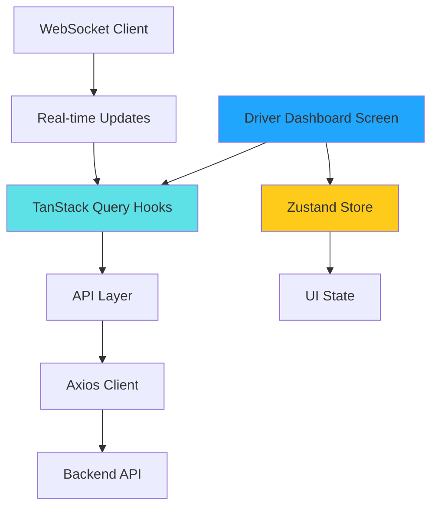

# Design Document: Driver Dashboard Module

## Overview

The Driver Dashboard module provides drivers with a comprehensive interface to manage their moving service operations. It serves as the primary workspace where drivers can monitor performance metrics, manage active moves, and accept new job requests through a first-come-first-serve allocation system.

### Key Features

- **Real-time Performance Metrics**: Display trip count, weekly income, clients served, and distance traveled
- **Active Move Management**: View and manage ongoing moves with urgency indicators
- **Job Request System**: Browse and accept available move requests on a first-come-first-serve basis
- **Real-time Updates**: WebSocket-based live updates for new requests and status changes
- **Pull-to-Refresh**: Manual data synchronization capability
- **Responsive Layout**: Adaptive design for various mobile device sizes

### Technical Approach

The module follows the Masqany architecture pattern with strict separation between server state (TanStack Query) and client state (Zustand). All API interactions are abstracted through a dedicated module structure, and the UI leverages NativeWind for consistent styling using design tokens.

## Architecture

### Module Structure

Following the Masqany module pattern:

```
modules/driver-dashboard/
├── api.ts           # Pure HTTP calls for driver dashboard data
├── hooks.ts         # TanStack Query hooks for server state
├── types.ts         # TypeScript interfaces and types
├── store.ts         # Zustand store for UI state
└── index.ts         # Public API exports
```

### State Management Strategy

**Server State (TanStack Query)**:
- Driver profile information
- Performance metrics (trips, income, clients, distance)
- Active moves list
- Upcoming move requests
- Move acceptance/rejection operations

**Client State (Zustand)**:
- Pull-to-refresh loading state
- Optimistic UI updates for move confirmations
- Connection status indicators
- Selected filters (if any)

### Data Flow



### API Integration

**Base URL**: `https://www.masqany.speqlink.com/api/v1/`

**Endpoints**:
- `GET /driver/dashboard` - Fetch complete dashboard data
- `GET /driver/profile` - Fetch driver profile
- `GET /driver/metrics` - Fetch performance metrics
- `GET /driver/moves/active` - Fetch active moves
- `GET /driver/moves/upcoming` - Fetch available move requests
- `POST /driver/moves/:id/accept` - Accept a move request
- `POST /driver/moves/:id/reject` - Reject a move request
- `POST /driver/moves/:id/start` - Start an active move

**WebSocket Connection**:
- `wss://www.masqany.speqlink.com/ws/driver` - Real-time updates channel

## Components and Interfaces

### Screen Component

**DriverDashboardScreen** (`app/(driver)/dashboard.tsx`)
- Main screen component using Expo Router
- Implements pull-to-refresh gesture
- Orchestrates all child components
- Manages navigation to detail screens

### UI Components

**DriverProfileCard** (`components/driver-dashboard/DriverProfileCard.tsx`)
- Displays driver photo, name, verification badge
- Shows excellence rating with star icon
- Displays current location
- Gradient background (#5ed0e6 → #004aad)
- Width: ~50% screen width, Height: 50px

**MetricsCard** (`components/driver-dashboard/MetricsCard.tsx`)
- Reusable component for displaying a single metric
- Props: icon, label, value, unit
- Gradient background (#5ed0e6 → #004aad)
- Rounded corners with shadow styling
- Used for: trips, income, clients, distance

**MetricsGrid** (`components/driver-dashboard/MetricsGrid.tsx`)
- Container for 4 MetricsCard components
- 2x2 grid layout on standard phones
- Responsive spacing using design tokens

**ActiveMoveCard** (`components/driver-dashboard/ActiveMoveCard.tsx`)
- Displays active move details
- Shows urgency badge ("STARTS SOON") when applicable
- Countdown timer for time-sensitive moves
- Action buttons: Start Move, Message, Call
- Background: #E1E6E8 with rounded corners and shadow

**UpcomingMoveCard** (`components/driver-dashboard/UpcomingMoveCard.tsx`)
- Displays available move request details
- Shows: client name, unit type, cost, locations, time allocation
- Action buttons: Confirm, Reject
- Background: #E1E6E8 with rounded corners and shadow

**SectionHeader** (`components/driver-dashboard/SectionHeader.tsx`)
- Reusable section header component
- Props: icon, title, actionText, onActionPress
- Used for "Active moves!!" and "Upcoming moves" sections

### Layout Components

**StatusBarProtection** (`components/driver-dashboard/StatusBarProtection.tsx`)
- Height: 3.5% of screen height
- Background: #20A6FD
- Provides safe area spacing for status bar

**TabBarProtection** (`components/driver-dashboard/TabBarProtection.tsx`)
- Height: 100px
- Background: #3fbdfd
- Provides safe area spacing for bottom navigation

## Data Models

### Driver Profile

```typescript
interface DriverProfile {
  id: string;
  name: string;
  email: string;
  phone: string;
  profilePhotoUrl: string;
  isVerified: boolean;
  excellenceRating: number; // 0-5
  currentLocation: string;
  vehicleId?: string;
  licenseNumber: string;
  createdAt: string;
  updatedAt: string;
}
```

### Performance Metrics

```typescript
interface DriverMetrics {
  totalTrips: number;
  weeklyIncome: number; // in KES
  totalClients: number;
  totalDistanceKm: number;
  lastUpdated: string;
}
```

### Active Move

```typescript
interface ActiveMove {
  id: string;
  clientId: string;
  clientName: string;
  clientPhone: string;
  houseType: string;
  pickupLocation: string;
  destinationLocation: string;
  scheduledStartTime: string; // ISO 8601
  status: 'accepted' | 'in_progress' | 'completed';
  isUrgent: boolean;
  minutesUntilStart?: number;
  serviceCost: number;
  createdAt: string;
}
```

### Move Request

```typescript
interface MoveRequest {
  id: string;
  clientId: string;
  clientName: string;
  unitType: string; // e.g., "2 Bedroom", "Studio"
  serviceCost: number; // in KES
  pickupLocation: string;
  destinationLocation: string;
  timeAllocated: number; // in hours
  scheduledDate: string; // ISO 8601 date
  scheduledTime: string; // HH:mm format
  status: 'available' | 'accepted' | 'rejected';
  createdAt: string;
}
```

### Dashboard Data Response

```typescript
interface DashboardData {
  profile: DriverProfile;
  metrics: DriverMetrics;
  activeMoves: ActiveMove[];
  upcomingMoves: MoveRequest[];
}
```

### API Response Types

```typescript
interface ApiResponse<T> {
  success: boolean;
  data: T;
  message?: string;
}

interface PaginatedResponse<T> {
  success: boolean;
  data: T[];
  pagination: {
    page: number;
    pageSize: number;
    total: number;
    hasMore: boolean;
  };
}
```

### Mutation Payloads

```typescript
interface AcceptMovePayload {
  moveRequestId: string;
  driverId: string;
  acceptedAt: string;
}

interface RejectMovePayload {
  moveRequestId: string;
  driverId: string;
  rejectionReason?: string;
}

interface StartMovePayload {
  activeMoveId: string;
  driverId: string;
  startedAt: string;
  currentLocation: {
    latitude: number;
    longitude: number;
  };
}
```

## Correctness Properties

*A property is a characteristic or behavior that should hold true across all valid executions of a system—essentially, a formal statement about what the system should do. Properties serve as the bridge between human-readable specifications and machine-verifiable correctness guarantees.*

This feature is primarily a UI-driven dashboard with real-time data display and user interactions. While property-based testing is valuable for data transformations and business logic, the Driver Dashboard module is better suited for:

1. **Integration tests** - Verifying API interactions and data flow
2. **Component tests** - Testing UI rendering with various data states
3. **E2E tests** - Validating user workflows (accept move, start move, etc.)

The module does not contain complex algorithmic logic or data transformations that would benefit significantly from property-based testing. The core functionality involves:
- Displaying server data in UI components
- Handling user interactions (button clicks, pull-to-refresh)
- Managing optimistic UI updates
- Real-time data synchronization

Therefore, **we will skip the Correctness Properties section** and focus on comprehensive unit tests, integration tests, and E2E tests in the Testing Strategy section.

## Error Handling

### Error Categories

**Network Errors**:
- Connection timeout (15s)
- No internet connection
- Server unreachable
- WebSocket disconnection

**API Errors**:
- 400 Bad Request - Invalid payload
- 401 Unauthorized - Token expired
- 403 Forbidden - Insufficient permissions
- 404 Not Found - Resource doesn't exist
- 409 Conflict - Move already accepted by another driver
- 500 Internal Server Error - Backend failure

**Business Logic Errors**:
- Move request no longer available
- Driver not verified
- Active move limit reached
- Invalid move status transition

### Error Handling Strategy

**API Layer** (`api.ts`):
```typescript
// All errors are normalized by apiClient interceptor
// Returns ApiError { message, status, code }
```

**Query Hooks** (`hooks.ts`):
```typescript
// TanStack Query provides error state automatically
const { data, error, isError, isLoading } = useDriverDashboard();

// Retry configuration
{
  retry: 2,
  retryDelay: (attemptIndex) => Math.min(1000 * 2 ** attemptIndex, 30000)
}
```

**UI Components**:
```typescript
// Display error messages with retry option
{isError && (
  <ErrorMessage 
    message={error.message} 
    onRetry={() => refetch()} 
  />
)}

// Loading states
{isLoading && <LoadingSpinner />}

// Empty states
{data?.activeMoves.length === 0 && <EmptyState />}
```

**Optimistic Updates**:
```typescript
// Revert on error
onError: (error, variables, context) => {
  // Rollback optimistic update
  queryClient.setQueryData(queryKey, context.previousData);
  // Show error toast
  showErrorToast(error.message);
}
```

**WebSocket Reconnection**:
```typescript
// Automatic reconnection with exponential backoff
const reconnect = () => {
  const delay = Math.min(1000 * 2 ** reconnectAttempts, 30000);
  setTimeout(() => connectWebSocket(), delay);
};
```

### User-Facing Error Messages

| Error Type | User Message | Action |
|------------|--------------|--------|
| Network timeout | "Connection timed out. Please check your internet." | Retry button |
| Move already accepted | "This move has been accepted by another driver." | Remove from list |
| Unauthorized | "Session expired. Please log in again." | Navigate to login |
| Server error | "Something went wrong. Please try again." | Retry button |
| WebSocket disconnect | "Live updates paused. Reconnecting..." | Auto-reconnect |

## Testing Strategy

### Unit Tests

**Component Tests** (React Native Testing Library):
- DriverProfileCard renders correctly with all props
- MetricsCard displays formatted values (currency, distance)
- ActiveMoveCard shows urgency badge when applicable
- UpcomingMoveCard displays all required information
- Action buttons trigger correct callbacks
- Loading states render correctly
- Error states display appropriate messages
- Empty states show when no data available

**Hook Tests** (TanStack Query Testing):
- useDriverDashboard fetches and caches data correctly
- useAcceptMove triggers optimistic update
- useRejectMove removes request from list
- Query invalidation works after mutations
- Error handling returns normalized errors
- Retry logic executes with exponential backoff

**Store Tests** (Zustand):
- UI state updates correctly
- Optimistic updates apply immediately
- State resets on error
- Selectors return correct values

### Integration Tests

**API Integration**:
- Dashboard data fetches successfully
- Accept move request sends correct payload
- Reject move request updates server state
- Start move navigates to execution screen
- WebSocket connection establishes correctly
- Real-time updates trigger query invalidation

**Navigation Integration**:
- Tapping "Start Move" navigates to move execution screen
- Message button opens chat with correct client
- Call button initiates phone call
- Tab navigation works correctly
- Back navigation preserves state

### End-to-End Tests (Detox)

**Critical User Flows**:
1. **View Dashboard**: Driver opens app → sees profile, metrics, moves
2. **Accept Move**: Driver taps Confirm → optimistic update → server confirms → move appears in active list
3. **Reject Move**: Driver taps Reject → move removed from list
4. **Start Move**: Driver taps Start Move → navigates to execution screen
5. **Pull to Refresh**: Driver pulls down → loading indicator → data refreshes
6. **Real-time Update**: New move request arrives → automatically appears in list
7. **Handle Conflict**: Driver accepts move already taken → error message → move removed

### Performance Tests

**Metrics to Monitor**:
- Initial load time < 2s
- Pull-to-refresh completes < 1s
- Optimistic update applies < 100ms
- WebSocket message processing < 200ms
- Memory usage stable over 30min session
- No memory leaks on repeated navigation

### Mock Data Strategy

**Development Mode**:
```typescript
// constants/data/driver-dashboard.ts
export const mockDriverProfile: DriverProfile = { ... };
export const mockMetrics: DriverMetrics = { ... };
export const mockActiveMoves: ActiveMove[] = [ ... ];
export const mockUpcomingMoves: MoveRequest[] = [ ... ];
```

**API Mocking** (MSW for tests):
```typescript
// Use Mock Service Worker for consistent test data
handlers: [
  rest.get('/driver/dashboard', (req, res, ctx) => {
    return res(ctx.json(mockDashboardData));
  }),
]
```

**Feature Flag**:
```typescript
// Easy switching between mock and real API
const USE_MOCK_DATA = __DEV__ && process.env.EXPO_PUBLIC_USE_MOCK === 'true';
```

### Test Coverage Goals

- Unit tests: > 80% coverage
- Integration tests: All API endpoints
- E2E tests: All critical user flows
- Accessibility tests: All interactive elements meet WCAG 2.1 AA

### Testing Tools

- **Unit/Integration**: Jest + React Native Testing Library
- **E2E**: Detox
- **API Mocking**: MSW (Mock Service Worker)
- **Visual Regression**: Storybook + Chromatic (optional)
- **Performance**: React Native Performance Monitor

---

## Implementation Notes

### Design Token Usage

All styling must use tokens from `constants/tokens.ts`:

```typescript
import { colors, spacing, typography, radius, shadow } from '@/constants/tokens';

// Gradient backgrounds
background: `linear-gradient(90deg, ${colors.gradient.start}, ${colors.gradient.end})`

// Spacing
padding: spacing.md
margin: spacing.lg

// Typography
fontSize: typography.size.base
fontFamily: typography.family.semibold

// Shadows
...shadow.md
```

### Icon and Image Assets

All assets must be imported from `constants/icons.ts` and `constants/images.ts`:

```typescript
import { icons } from '@/constants/icons';
import { images } from '@/constants/images';

<Image source={icons.verifiedCheck} />
<Image source={images.appFullScreen} />
```

### Responsive Design

Use percentage-based widths and flexible layouts:

```typescript
// Driver Profile Card
width: '50%'  // Adapts to screen width

// Metrics Grid
<View className="flex-row flex-wrap">
  {/* 2x2 grid on standard phones, adapts on tablets */}
</View>
```

### Accessibility

All interactive elements must meet minimum touch target size (44x44 points):

```typescript
<TouchableOpacity 
  style={{ minWidth: 44, minHeight: 44 }}
  accessibilityLabel="Accept move request"
  accessibilityRole="button"
>
  <Text>Confirm</Text>
</TouchableOpacity>
```

### WebSocket Integration

Placeholder for real-time updates (implement when ready):

```typescript
// lib/ws/client.ts
export const driverWebSocket = {
  connect: (driverId: string) => { ... },
  disconnect: () => { ... },
  onNewMoveRequest: (callback) => { ... },
  onMoveStatusChange: (callback) => { ... },
};
```

### Offline Support

Placeholder for offline queue (implement when ready):

```typescript
// lib/offline/index.ts
export const offlineQueue = {
  addMutation: (mutation) => { ... },
  processPending: () => { ... },
};
```

---

## Dependencies

### Required Packages

- `@tanstack/react-query` - Server state management
- `zustand` - Client state management
- `axios` - HTTP client
- `expo-router` - Navigation
- `nativewind` - Styling
- `react-native-reanimated` - Animations
- `react-native-gesture-handler` - Touch gestures

### Optional Packages (Future)

- `socket.io-client` - WebSocket for real-time updates
- `@react-native-community/netinfo` - Network status monitoring
- `react-native-mmkv` - Offline storage

---

## Migration and Rollout

### Phase 1: Core Dashboard (Week 1)
- Implement module structure (api.ts, hooks.ts, types.ts, store.ts)
- Create UI components with mock data
- Implement pull-to-refresh
- Basic error handling

### Phase 2: API Integration (Week 2)
- Connect to real backend endpoints
- Implement mutations (accept, reject, start)
- Add optimistic updates
- Comprehensive error handling

### Phase 3: Real-time Updates (Week 3)
- Implement WebSocket connection
- Handle live move request updates
- Add connection status indicators
- Implement auto-reconnection

### Phase 4: Polish and Testing (Week 4)
- Complete test coverage
- Performance optimization
- Accessibility audit
- Documentation

---

## Open Questions

1. **WebSocket Protocol**: What is the exact message format for real-time updates?
2. **Move Acceptance Race Condition**: How does the backend handle simultaneous acceptance attempts?
3. **Metrics Calculation**: Are metrics calculated in real-time or cached?
4. **Urgency Threshold**: What time window defines "STARTS SOON" (e.g., < 30 minutes)?
5. **Pagination**: Should upcoming moves be paginated or load all available?
6. **Offline Behavior**: Should accepted moves be queued when offline?
7. **Push Notifications**: Should drivers receive push notifications for new move requests?

---

## References

- Requirements Document: `.kiro/specs/driver-dashboard/requirements.md`
- Implementation Guide: `docs/IMPLEMENTATION_GUIDE.md`
- Architecture Guide: `.kiro/steering/architecture.md`
- Design Tokens: `constants/tokens.ts`
- API Client: `lib/api/client.ts`
