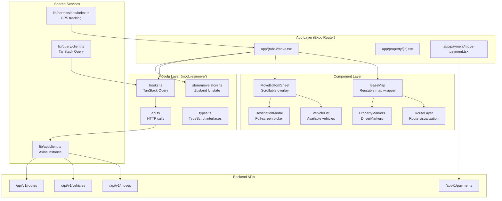

# Technical Design Document: Enterprise Map & Moving Service

## Overview

The Enterprise Map & Moving Service module transforms the prototype map implementation into a production-ready system supporting two core functions:

1. **Moving Service**: Complete relocation workflow with vehicle booking, real-time tracking, route visualization, and payment processing
2. **Property Navigation**: Route visualization from user location to property listings with distance and time estimates

This module integrates seamlessly with the existing Masqany architecture, following the established two-layer state management pattern (TanStack Query for server state, Zustand for UI state) and modular structure.

### Key Features

- Real-time GPS location tracking with 5-second updates
- Interactive map with property and driver markers
- Route visualization with distance markers
- Vehicle selection with live availability and pricing
- M-Pesa and card payment integration
- Offline route caching (50 most recent routes)
- Bottom sheet UI with smooth scrolling
- Scheduled move booking (2 hours to 30 days ahead)
- 60 FPS performance with marker clustering for 100+ markers

### Technology Stack

- **Map Engine**: Mapbox GL Native (via @rnmapbox/maps)
- **State Management**: TanStack Query (server) + Zustand (UI)
- **Location Services**: expo-location
- **HTTP Client**: Axios (shared apiClient)
- **UI Framework**: React Native + NativeWind (Tailwind)
- **Navigation**: Expo Router (file-based routing)


## Architecture

### High-Level Component Diagram




### Module Architecture

Following the established Masqany architecture pattern:

```
modules/move/
├── api.ts              # Pure HTTP calls (no React dependencies)
├── hooks.ts            # TanStack Query hooks (public API)
├── types.ts            # TypeScript interfaces
├── index.ts            # Public exports
└── store/
    └── move.store.ts   # Zustand UI state slice
```

**State Management Boundaries:**

| State Type | Storage | Examples |
|------------|---------|----------|
| **Server State** | TanStack Query | Vehicle availability, pricing, routes, bookings |
| **UI State** | Zustand | Map viewport, selected vehicle, bottom sheet position, modal visibility |
| **Cached Data** | AsyncStorage | Offline route geometry (50 most recent) |

**Key Architectural Principles:**

1. **No Direct API Calls**: Components never import `apiClient` or `api.ts` directly
2. **Hooks as Public API**: All data access goes through `hooks.ts`
3. **Single Axios Instance**: Use shared `lib/api/client.ts` (auth interceptors included)
4. **Selector Pattern**: Always use Zustand selectors (never `const state = useStore()`)
5. **Query Key Structure**: Hierarchical keys for precise cache invalidation


### Component Hierarchy

```
MoveScreen (app/(tabs)/move.tsx)
├── BaseMap (reusable map wrapper)
│   ├── Mapbox.MapView
│   ├── Mapbox.Camera (controlled by cameraRef)
│   ├── Mapbox.UserLocation (GPS tracking)
│   ├── RouteLayer (blue route lines)
│   ├── PropertyMarkers (vacant properties)
│   └── DriverMarkers (available drivers)
├── MapSearchBar (location search)
├── LocateMeButton (center on user)
├── MoveBottomSheet (scrollable overlay)
│   ├── DestinationSelector (opens modal)
│   ├── VehicleList (available vehicles with pricing)
│   └── ConfirmButton (navigate to payment)
├── DestinationModal (full-screen)
│   ├── LocationSearch (filter destinations)
│   ├── SuggestedLocations (with distances)
│   └── VehicleTypeSelector (pickup, van, truck)
└── TabBarProtection (fixed 100px blue bar)
```

**Component Responsibilities:**

- **MoveScreen**: Orchestrates state, handles navigation, manages refs
- **BaseMap**: Provides map instance, handles permissions, exposes camera control
- **MoveBottomSheet**: Displays move options, manages snap positions (0.3, 0.7, 1.0)
- **DestinationModal**: Full-screen destination picker with search and vehicle selection
- **RouteLayer**: Renders route geometry from TanStack Query cache
- **VehicleList**: Displays available vehicles from real-time query (30s stale time)


## Components and Interfaces

### Core Components

#### 1. MoveScreen (app/(tabs)/move.tsx)

**Purpose**: Main orchestrator for moving service and property navigation

**State Management**:
```typescript
// Local state
const [searchQuery, setSearchQuery] = useState("")
const [selectedPropertyId, setSelectedPropertyId] = useState<number | null>(null)
const [currentCoordinate, setCurrentCoordinate] = useState<[number, number] | null>(null)

// Refs
const cameraRef = useRef<Mapbox.Camera>(null)
const mapRef = useRef<Mapbox.MapView>(null)

// Zustand selectors
const selectedVehicle = useMoveStore(s => s.selectedVehicle)
const destination = useMoveStore(s => s.destination)
const sheetPosition = useMoveStore(s => s.sheetPosition)

// TanStack Query
const { data: vehicles } = useAvailableVehicles(destination, currentCoordinate)
const { data: route } = useRoute(currentCoordinate, destination)
```

**Key Methods**:
- `handleMarkerPress(propertyId)`: Zoom to property, update selection
- `handleLocateMe()`: Request permissions, center on user location
- `handleVehicleSelect(vehicle)`: Update Zustand store, show confirmation
- `handleConfirmMove()`: Navigate to payment screen with booking data


#### 2. MoveBottomSheet

**Purpose**: Scrollable overlay displaying move options and vehicle selection

**Props**:
```typescript
interface MoveBottomSheetProps {
  bottomInset: number              // Tab bar height + padding
  selectedPropertyId: number | null
  onSelectProperty: (id: number) => void
  onOpenProperty: (id: number) => void
  onSnapChange: (fraction: number) => void  // 0.3, 0.7, 1.0
}
```

**Snap Points**: 
- 0.3 (collapsed): Shows "Move with Masqany" title + current location
- 0.7 (half): Shows vehicle list with pricing
- 1.0 (full): Shows full vehicle details + confirmation

**Implementation**:
- Use `@gorhom/bottom-sheet` library
- Animate snap transitions with 300ms duration
- Prevent map interactions when fully expanded
- Maintain 100px bottom padding for tab bar protection


#### 3. DestinationModal

**Purpose**: Full-screen destination picker with search and vehicle type selection

**Props**:
```typescript
interface DestinationModalProps {
  visible: boolean
  currentLocation: [number, number] | null
  onClose: () => void
  onSelect: (destination: Location, vehicleType: VehicleType) => void
}
```

**Features**:
- Search input with debounced filtering (300ms)
- Suggested locations sorted by distance from user
- Distance calculation using Haversine formula
- Vehicle type selector (pickup, mini truck, truck)
- Thin black divider lines between location entries
- Close button in top-right corner

**State Flow**:
1. User taps destination selector in bottom sheet
2. Modal opens with pre-selected current location
3. User searches/selects destination
4. User selects vehicle type
5. Modal closes, returns to map with selected data
6. Triggers vehicle availability query


#### 4. RouteLayer

**Purpose**: Renders route geometry on map with distance markers

**Props**:
```typescript
interface RouteLayerProps {
  route: RouteGeometry | null
  color?: string  // Default: #20A6FD (primary-700)
  showDistanceMarkers?: boolean
}
```

**Implementation**:
```typescript
// Route geometry from TanStack Query
const { data: route } = useRoute(origin, destination)

// Render as Mapbox LineLayer
<Mapbox.ShapeSource id="route" shape={route?.geometry}>
  <Mapbox.LineLayer
    id="route-line"
    style={{
      lineColor: colors.primary[700],
      lineWidth: 4,
      lineCap: 'round',
      lineJoin: 'round',
    }}
  />
</Mapbox.ShapeSource>

// Distance markers every 1km
{route?.distanceMarkers.map((marker, i) => (
  <Mapbox.PointAnnotation
    key={i}
    id={`marker-${i}`}
    coordinate={marker.coordinate}
  >
    <View className="bg-white px-2 py-1 rounded-full">
      <Text className="text-xs font-semibold">{marker.distance}km</Text>
    </View>
  </Mapbox.PointAnnotation>
))}
```


#### 5. VehicleList

**Purpose**: Displays available vehicles with pricing and ETA

**Props**:
```typescript
interface VehicleListProps {
  vehicles: AvailableVehicle[]
  selectedVehicleId: string | null
  onSelect: (vehicle: AvailableVehicle) => void
}
```

**Vehicle Card Layout**:
```
┌─────────────────────────────────────┐
│ 🚗 Pickup Truck                     │
│ KES 1,500                           │
│ Arrives in 8 minutes                │
│ 2.3 km away                         │
└─────────────────────────────────────┘
```

**Interaction**:
- Tap to select vehicle
- Selected vehicle highlighted with primary-700 border
- Smooth scroll animation to selected item
- Shows loading skeleton while fetching availability


## Data Models

### Core Types (modules/move/types.ts)

```typescript
// Vehicle Types
export type VehicleType = "pickup" | "mini_truck" | "truck"

export interface Vehicle {
  id: string
  type: VehicleType
  licensePlate: string
  capacity: {
    weight: number      // kg
    volume: number      // cubic meters
  }
  status: "available" | "busy" | "offline"
}

// Available Vehicle (with real-time data)
export interface AvailableVehicle {
  id: string
  vehicleId: string
  driverId: string
  type: VehicleType
  currentLocation: Coordinates
  estimatedArrival: number  // minutes
  distance: number          // kilometers
  price: number
  currency: string
}

// Location Types
export interface Coordinates {
  longitude: number
  latitude: number
}

export interface Location {
  id?: string
  name: string
  address: string
  coordinates: Coordinates
  type: "property" | "custom" | "saved"
}
```


```typescript
// Route Types
export interface RouteGeometry {
  type: "LineString"
  coordinates: [number, number][]  // [longitude, latitude]
}

export interface Route {
  id: string
  origin: Coordinates
  destination: Coordinates
  geometry: RouteGeometry
  distance: number          // kilometers
  duration: number          // minutes
  distanceMarkers: DistanceMarker[]
  cachedAt?: string        // ISO timestamp for offline routes
}

export interface DistanceMarker {
  coordinate: [number, number]
  distance: number  // kilometers from origin
}

// Booking Types
export type MoveStatus = 
  | "pending"           // Awaiting payment
  | "confirmed"         // Payment successful, driver assigned
  | "in_transit"        // Driver en route or moving items
  | "completed"         // Move finished
  | "cancelled"         // User or system cancelled

export interface MoveBooking {
  id: string
  userId: string
  vehicleId: string
  driverId?: string
  pickupLocation: Location
  dropoffLocation: Location
  vehicleType: VehicleType
  scheduledAt: string   // ISO timestamp
  estimatedPrice: number
  finalPrice?: number
  currency: string
  status: MoveStatus
  paymentId?: string
  notes?: string
  createdAt: string
  updatedAt: string
}
```


```typescript
// Request/Response Payloads
export interface CreateMovePayload {
  pickupLocation: Location
  dropoffLocation: Location
  vehicleType: VehicleType
  scheduledAt: string   // ISO timestamp (min: now + 2 hours, max: now + 30 days)
  notes?: string
}

export interface VehicleAvailabilityRequest {
  location: Coordinates
  vehicleType?: VehicleType  // Optional filter
  radius?: number            // Search radius in km (default: 10)
}

export interface RouteRequest {
  origin: Coordinates
  destination: Coordinates
  profile?: "driving" | "walking"  // Default: driving
}

export interface PriceEstimateRequest {
  pickupLocation: Coordinates
  dropoffLocation: Coordinates
  vehicleType: VehicleType
}

export interface PriceEstimateResponse {
  basePrice: number
  distancePrice: number
  totalPrice: number
  currency: string
  breakdown: {
    baseFee: number
    perKmRate: number
    distance: number
  }
}
```


```typescript
// Payment Types
export type PaymentMethod = "mpesa" | "card"
export type PaymentStatus = "pending" | "processing" | "completed" | "failed" | "timeout"

export interface PaymentRequest {
  bookingId: string
  amount: number
  currency: string
  method: PaymentMethod
  phoneNumber?: string  // Required for M-Pesa
  cardToken?: string    // Required for card payment
}

export interface PaymentResponse {
  id: string
  bookingId: string
  status: PaymentStatus
  transactionId?: string
  message?: string
  createdAt: string
}

// Zustand UI State
export interface MoveUIState {
  // Destination modal
  isDestinationModalVisible: boolean
  selectedDestination: Location | null
  selectedVehicleType: VehicleType | null
  
  // Vehicle selection
  selectedVehicle: AvailableVehicle | null
  
  // Bottom sheet
  sheetPosition: 0.3 | 0.7 | 1.0
  
  // Map viewport
  mapRegion: {
    latitude: number
    longitude: number
    zoom: number
  }
  
  // Actions
  openDestinationModal: () => void
  closeDestinationModal: () => void
  setDestination: (location: Location, vehicleType: VehicleType) => void
  selectVehicle: (vehicle: AvailableVehicle) => void
  setSheetPosition: (position: 0.3 | 0.7 | 1.0) => void
  setMapRegion: (region: MoveUIState['mapRegion']) => void
  reset: () => void
}
```


## API Endpoints and Integration

### API Layer (modules/move/api.ts)

```typescript
import { apiClient } from "@/lib/api/client"
import type {
  AvailableVehicle,
  CreateMovePayload,
  MoveBooking,
  PriceEstimateRequest,
  PriceEstimateResponse,
  Route,
  RouteRequest,
  VehicleAvailabilityRequest,
} from "./types"

export const moveApi = {
  // Vehicle Availability
  getAvailableVehicles: (params: VehicleAvailabilityRequest) =>
    apiClient
      .get<AvailableVehicle[]>("/moves/vehicles/available", { params })
      .then(r => r.data),

  // Route Calculation
  calculateRoute: (params: RouteRequest) =>
    apiClient
      .post<Route>("/moves/routes/calculate", params)
      .then(r => r.data),

  // Price Estimation
  estimatePrice: (params: PriceEstimateRequest) =>
    apiClient
      .post<PriceEstimateResponse>("/moves/estimate", params)
      .then(r => r.data),

  // Booking Management
  createBooking: (payload: CreateMovePayload) =>
    apiClient
      .post<MoveBooking>("/moves/bookings", payload)
      .then(r => r.data),

  getMyBookings: () =>
    apiClient
      .get<MoveBooking[]>("/moves/bookings/me")
      .then(r => r.data),

  getBookingById: (id: string) =>
    apiClient
      .get<MoveBooking>(`/moves/bookings/${id}`)
      .then(r => r.data),

  cancelBooking: (id: string) =>
    apiClient
      .post(`/moves/bookings/${id}/cancel`)
      .then(r => r.data),

  // Property Navigation
  getPropertyRoute: (propertyId: string, userLocation: Coordinates) =>
    apiClient
      .post<Route>("/moves/routes/property", {
        propertyId,
        origin: userLocation,
      })
      .then(r => r.data),
}
```


### API Contracts

#### GET /moves/vehicles/available

**Request Query Parameters**:
```typescript
{
  location: {
    latitude: number
    longitude: number
  }
  vehicleType?: "pickup" | "mini_truck" | "truck"
  radius?: number  // km, default: 10
}
```

**Response** (200 OK):
```json
[
  {
    "id": "av_123",
    "vehicleId": "veh_456",
    "driverId": "drv_789",
    "type": "pickup",
    "currentLocation": {
      "latitude": -1.2921,
      "longitude": 36.8219
    },
    "estimatedArrival": 8,
    "distance": 2.3,
    "price": 1500,
    "currency": "KES"
  }
]
```

**Error Responses**:
- 400: Invalid location coordinates
- 404: No vehicles available in area


#### POST /moves/routes/calculate

**Request Body**:
```json
{
  "origin": {
    "latitude": -1.2921,
    "longitude": 36.8219
  },
  "destination": {
    "latitude": -1.2864,
    "longitude": 36.8172
  },
  "profile": "driving"
}
```

**Response** (200 OK):
```json
{
  "id": "route_123",
  "origin": { "latitude": -1.2921, "longitude": 36.8219 },
  "destination": { "latitude": -1.2864, "longitude": 36.8172 },
  "geometry": {
    "type": "LineString",
    "coordinates": [
      [36.8219, -1.2921],
      [36.8195, -1.2893],
      [36.8172, -1.2864]
    ]
  },
  "distance": 5.2,
  "duration": 12,
  "distanceMarkers": [
    { "coordinate": [36.8195, -1.2893], "distance": 1.0 },
    { "coordinate": [36.8183, -1.2878], "distance": 2.0 }
  ]
}
```

**Error Responses**:
- 400: Invalid coordinates
- 404: No route found
- 503: Routing service unavailable


#### POST /moves/estimate

**Request Body**:
```json
{
  "pickupLocation": {
    "latitude": -1.2921,
    "longitude": 36.8219
  },
  "dropoffLocation": {
    "latitude": -1.2864,
    "longitude": 36.8172
  },
  "vehicleType": "pickup"
}
```

**Response** (200 OK):
```json
{
  "basePrice": 500,
  "distancePrice": 1000,
  "totalPrice": 1500,
  "currency": "KES",
  "breakdown": {
    "baseFee": 500,
    "perKmRate": 200,
    "distance": 5.0
  }
}
```

#### POST /moves/bookings

**Request Body**:
```json
{
  "pickupLocation": {
    "name": "Westlands",
    "address": "Westlands, Nairobi",
    "coordinates": { "latitude": -1.2921, "longitude": 36.8219 }
  },
  "dropoffLocation": {
    "name": "Karen",
    "address": "Karen, Nairobi",
    "coordinates": { "latitude": -1.2864, "longitude": 36.8172 }
  },
  "vehicleType": "pickup",
  "scheduledAt": "2024-01-15T14:00:00Z",
  "notes": "Fragile items"
}
```

**Response** (201 Created):
```json
{
  "id": "move_123",
  "userId": "user_456",
  "vehicleId": "veh_789",
  "pickupLocation": { ... },
  "dropoffLocation": { ... },
  "vehicleType": "pickup",
  "scheduledAt": "2024-01-15T14:00:00Z",
  "estimatedPrice": 1500,
  "currency": "KES",
  "status": "pending",
  "createdAt": "2024-01-15T12:00:00Z",
  "updatedAt": "2024-01-15T12:00:00Z"
}
```


## State Management with TanStack Query

### Query Keys Structure

```typescript
export const moveKeys = {
  all: ["moves"] as const,
  
  // Vehicle availability
  vehicles: () => [...moveKeys.all, "vehicles"] as const,
  availableVehicles: (location: Coordinates, type?: VehicleType) =>
    [...moveKeys.vehicles(), "available", location, type] as const,
  
  // Routes
  routes: () => [...moveKeys.all, "routes"] as const,
  route: (origin: Coordinates, destination: Coordinates) =>
    [...moveKeys.routes(), origin, destination] as const,
  propertyRoute: (propertyId: string, userLocation: Coordinates) =>
    [...moveKeys.routes(), "property", propertyId, userLocation] as const,
  
  // Bookings
  bookings: () => [...moveKeys.all, "bookings"] as const,
  myBookings: () => [...moveKeys.bookings(), "mine"] as const,
  booking: (id: string) => [...moveKeys.bookings(), id] as const,
  
  // Price estimates
  estimates: () => [...moveKeys.all, "estimates"] as const,
}
```


### Query Hooks (modules/move/hooks.ts)

```typescript
import { useQuery, useMutation, useQueryClient } from "@tanstack/react-query"
import { moveApi } from "./api"
import type { Coordinates, VehicleType, CreateMovePayload } from "./types"

// Vehicle Availability (30s stale time for real-time updates)
export function useAvailableVehicles(
  location: Coordinates | null,
  vehicleType?: VehicleType
) {
  return useQuery({
    queryKey: moveKeys.availableVehicles(location!, vehicleType),
    queryFn: () => moveApi.getAvailableVehicles({ location: location!, vehicleType }),
    enabled: !!location,
    staleTime: 30 * 1000,  // 30 seconds
    refetchInterval: 30 * 1000,  // Auto-refetch every 30s
  })
}

// Route Calculation (5min stale time, cached for offline)
export function useRoute(
  origin: Coordinates | null,
  destination: Coordinates | null
) {
  return useQuery({
    queryKey: moveKeys.route(origin!, destination!),
    queryFn: () => moveApi.calculateRoute({ origin: origin!, destination: destination! }),
    enabled: !!origin && !!destination,
    staleTime: 5 * 60 * 1000,  // 5 minutes
    cacheTime: 24 * 60 * 60 * 1000,  // 24 hours for offline
  })
}

// Property Route (for "View on Map" feature)
export function usePropertyRoute(
  propertyId: string | null,
  userLocation: Coordinates | null
) {
  return useQuery({
    queryKey: moveKeys.propertyRoute(propertyId!, userLocation!),
    queryFn: () => moveApi.getPropertyRoute(propertyId!, userLocation!),
    enabled: !!propertyId && !!userLocation,
    staleTime: 5 * 60 * 1000,
  })
}
```


```typescript
// Price Estimation (mutation, not cached)
export function usePriceEstimate() {
  return useMutation({
    mutationFn: moveApi.estimatePrice,
  })
}

// My Bookings
export function useMyBookings() {
  return useQuery({
    queryKey: moveKeys.myBookings(),
    queryFn: moveApi.getMyBookings,
    staleTime: 2 * 60 * 1000,  // 2 minutes
  })
}

// Single Booking
export function useBooking(id: string | null) {
  return useQuery({
    queryKey: moveKeys.booking(id!),
    queryFn: () => moveApi.getBookingById(id!),
    enabled: !!id,
    staleTime: 30 * 1000,  // 30 seconds
  })
}

// Create Booking
export function useCreateBooking() {
  const queryClient = useQueryClient()
  
  return useMutation({
    mutationFn: (payload: CreateMovePayload) => moveApi.createBooking(payload),
    onSuccess: (newBooking) => {
      // Invalidate bookings list
      queryClient.invalidateQueries({ queryKey: moveKeys.myBookings() })
      
      // Optimistically add to cache
      queryClient.setQueryData(moveKeys.booking(newBooking.id), newBooking)
    },
  })
}

// Cancel Booking
export function useCancelBooking() {
  const queryClient = useQueryClient()
  
  return useMutation({
    mutationFn: (id: string) => moveApi.cancelBooking(id),
    onSuccess: (_, id) => {
      queryClient.invalidateQueries({ queryKey: moveKeys.myBookings() })
      queryClient.invalidateQueries({ queryKey: moveKeys.booking(id) })
    },
  })
}
```


### Cache Strategy

**TanStack Query Configuration**:
```typescript
// Global defaults (in lib/query/client.ts)
{
  staleTime: 5 * 60 * 1000,      // 5 minutes default
  cacheTime: 30 * 60 * 1000,     // 30 minutes default
  refetchOnWindowFocus: false,    // Mobile optimization
  retry: 2,
}

// Per-query overrides
useAvailableVehicles: {
  staleTime: 30 * 1000,           // 30 seconds (real-time)
  refetchInterval: 30 * 1000,     // Auto-refresh
}

useRoute: {
  staleTime: 5 * 60 * 1000,       // 5 minutes
  cacheTime: 24 * 60 * 60 * 1000, // 24 hours (offline support)
}
```

**Invalidation Strategy**:
- After booking creation: Invalidate `myBookings`
- After booking cancellation: Invalidate `myBookings` + specific `booking(id)`
- After payment success: Invalidate `booking(id)` to refresh status
- Never invalidate routes (long cache for offline)


## State Management with Zustand

### Zustand Store Implementation (modules/move/store/move.store.ts)

```typescript
import { create } from "zustand"
import type { AvailableVehicle, Location, VehicleType } from "../types"

interface MoveStore {
  // Destination modal
  isDestinationModalVisible: boolean
  selectedDestination: Location | null
  selectedVehicleType: VehicleType | null
  
  // Vehicle selection
  selectedVehicle: AvailableVehicle | null
  
  // Bottom sheet
  sheetPosition: 0.3 | 0.7 | 1.0
  
  // Map viewport
  mapRegion: {
    latitude: number
    longitude: number
    zoom: number
  }
  
  // Actions
  openDestinationModal: () => void
  closeDestinationModal: () => void
  setDestination: (location: Location, vehicleType: VehicleType) => void
  selectVehicle: (vehicle: AvailableVehicle | null) => void
  setSheetPosition: (position: 0.3 | 0.7 | 1.0) => void
  setMapRegion: (region: MoveStore["mapRegion"]) => void
  reset: () => void
}

const initialState = {
  isDestinationModalVisible: false,
  selectedDestination: null,
  selectedVehicleType: null,
  selectedVehicle: null,
  sheetPosition: 0.3 as const,
  mapRegion: {
    latitude: -1.2921,
    longitude: 36.8219,
    zoom: 12,
  },
}

export const useMoveStore = create<MoveStore>((set) => ({
  ...initialState,
  
  openDestinationModal: () => set({ isDestinationModalVisible: true }),
  closeDestinationModal: () => set({ isDestinationModalVisible: false }),
  
  setDestination: (location, vehicleType) =>
    set({
      selectedDestination: location,
      selectedVehicleType: vehicleType,
      isDestinationModalVisible: false,
    }),
  
  selectVehicle: (vehicle) => set({ selectedVehicle: vehicle }),
  
  setSheetPosition: (position) => set({ sheetPosition: position }),
  
  setMapRegion: (region) => set({ mapRegion: region }),
  
  reset: () => set(initialState),
}))
```


**Usage Pattern** (Always use selectors):

```typescript
// ❌ BAD: Causes unnecessary re-renders
const state = useMoveStore()

// ✅ GOOD: Only re-renders when specific value changes
const selectedVehicle = useMoveStore(s => s.selectedVehicle)
const selectVehicle = useMoveStore(s => s.selectVehicle)

// ✅ GOOD: Multiple values with shallow comparison
import { shallow } from "zustand/shallow"
const { destination, vehicleType } = useMoveStore(
  s => ({ destination: s.selectedDestination, vehicleType: s.selectedVehicleType }),
  shallow
)
```

### AsyncStorage (Offline Cache)

**Route Caching Strategy** (lib/offline/routeCache.ts):

```typescript
import AsyncStorage from "@react-native-async-storage/async-storage"
import type { Route } from "@/modules/move/types"

const ROUTE_CACHE_KEY = "move_routes_cache"
const MAX_CACHED_ROUTES = 50

interface CachedRoute extends Route {
  cachedAt: string
}

export const routeCache = {
  async save(route: Route): Promise<void> {
    const cached = await this.getAll()
    const newRoute: CachedRoute = { ...route, cachedAt: new Date().toISOString() }
    
    // Add to front, remove oldest if exceeds limit
    const updated = [newRoute, ...cached.filter(r => r.id !== route.id)].slice(0, MAX_CACHED_ROUTES)
    
    await AsyncStorage.setItem(ROUTE_CACHE_KEY, JSON.stringify(updated))
  },
  
  async getAll(): Promise<CachedRoute[]> {
    const data = await AsyncStorage.getItem(ROUTE_CACHE_KEY)
    return data ? JSON.parse(data) : []
  },
  
  async find(origin: Coordinates, destination: Coordinates): Promise<CachedRoute | null> {
    const cached = await this.getAll()
    return cached.find(r =>
      r.origin.latitude === origin.latitude &&
      r.origin.longitude === origin.longitude &&
      r.destination.latitude === destination.latitude &&
      r.destination.longitude === destination.longitude
    ) || null
  },
}
```


## Real-Time Location Tracking Implementation

### Location Service Integration

**Location Tracking Strategy**:
- Use `expo-location` for GPS access
- Request foreground permissions only (not background)
- Use "balanced" accuracy level (battery-efficient)
- Update location every 5 seconds while map is active
- Stop updates when map screen is inactive

**Implementation** (lib/permissions/location.ts):

```typescript
import * as Location from "expo-location"
import { useEffect, useState } from "react"

export interface LocationState {
  coordinates: [number, number] | null
  accuracy: number | null
  error: string | null
  permissionGranted: boolean
}

export function useLocationTracking(enabled: boolean = true) {
  const [state, setState] = useState<LocationState>({
    coordinates: null,
    accuracy: null,
    error: null,
    permissionGranted: false,
  })

  useEffect(() => {
    if (!enabled) return

    let subscription: Location.LocationSubscription | null = null

    async function startTracking() {
      try {
        // Request permissions
        const { status } = await Location.requestForegroundPermissionsAsync()
        
        if (status !== "granted") {
          setState(prev => ({
            ...prev,
            error: "Location permission denied",
            permissionGranted: false,
          }))
          return
        }

        setState(prev => ({ ...prev, permissionGranted: true }))

        // Start watching location
        subscription = await Location.watchPositionAsync(
          {
            accuracy: Location.Accuracy.Balanced,  // Battery-efficient
            timeInterval: 5000,  // 5 seconds
            distanceInterval: 10,  // 10 meters
          },
          (location) => {
            setState(prev => ({
              ...prev,
              coordinates: [location.coords.longitude, location.coords.latitude],
              accuracy: location.coords.accuracy,
              error: null,
            }))
          }
        )
      } catch (error) {
        setState(prev => ({
          ...prev,
          error: error instanceof Error ? error.message : "Location error",
        }))
      }
    }

    startTracking()

    return () => {
      subscription?.remove()
    }
  }, [enabled])

  return state
}
```


## Route Visualization and Caching Strategy

### Route Visualization

**Route Rendering**:
- Display routes as blue lines (#20A6FD) using Mapbox LineLayer
- Add distance markers every 1km along the route
- Animate route drawing with smooth transitions
- Support multiple simultaneous routes (driver to user)
- Auto-fit map viewport to show entire route

**Distance Marker Calculation**:
```typescript
// Calculate distance markers along route
export function calculateDistanceMarkers(
  geometry: RouteGeometry,
  intervalKm: number = 1
): DistanceMarker[] {
  const markers: DistanceMarker[] = []
  let accumulatedDistance = 0
  let nextMarkerDistance = intervalKm

  for (let i = 1; i < geometry.coordinates.length; i++) {
    const [lon1, lat1] = geometry.coordinates[i - 1]
    const [lon2, lat2] = geometry.coordinates[i]
    
    const segmentDistance = haversineDistance(
      { latitude: lat1, longitude: lon1 },
      { latitude: lat2, longitude: lon2 }
    )
    
    accumulatedDistance += segmentDistance

    if (accumulatedDistance >= nextMarkerDistance) {
      markers.push({
        coordinate: [lon2, lat2],
        distance: nextMarkerDistance,
      })
      nextMarkerDistance += intervalKm
    }
  }

  return markers
}

// Haversine formula for distance calculation
function haversineDistance(
  coord1: Coordinates,
  coord2: Coordinates
): number {
  const R = 6371 // Earth's radius in km
  const dLat = toRad(coord2.latitude - coord1.latitude)
  const dLon = toRad(coord2.longitude - coord1.longitude)
  
  const a =
    Math.sin(dLat / 2) * Math.sin(dLat / 2) +
    Math.cos(toRad(coord1.latitude)) *
    Math.cos(toRad(coord2.latitude)) *
    Math.sin(dLon / 2) *
    Math.sin(dLon / 2)
  
  const c = 2 * Math.atan2(Math.sqrt(a), Math.sqrt(1 - a))
  return R * c
}

function toRad(degrees: number): number {
  return degrees * (Math.PI / 180)
}
```


### Offline Route Caching

**Caching Strategy**:
- Cache up to 50 most recent routes in AsyncStorage
- Store route geometry, distance, duration, and markers
- Use LRU (Least Recently Used) eviction policy
- Display visual indicator when showing cached routes
- Attempt to load from cache when network is unavailable

**Cache Integration with TanStack Query**:
```typescript
// Enhanced route hook with offline support
export function useRoute(
  origin: Coordinates | null,
  destination: Coordinates | null
) {
  return useQuery({
    queryKey: moveKeys.route(origin!, destination!),
    queryFn: async () => {
      try {
        // Try to fetch from API
        const route = await moveApi.calculateRoute({ 
          origin: origin!, 
          destination: destination! 
        })
        
        // Save to cache on success
        await routeCache.save(route)
        
        return route
      } catch (error) {
        // On network error, try to load from cache
        const cached = await routeCache.find(origin!, destination!)
        
        if (cached) {
          console.log("[Route] Loaded from offline cache")
          return cached
        }
        
        throw error
      }
    },
    enabled: !!origin && !!destination,
    staleTime: 5 * 60 * 1000,
    cacheTime: 24 * 60 * 60 * 1000,
  })
}
```


## Payment Flow Integration

### Payment Screen Flow

**Navigation Flow**:
1. User selects vehicle and taps "Confirm Move"
2. Navigate to `/payment/move-payment` with booking data
3. Display payment options (M-Pesa, Card)
4. Process payment and poll for status
5. On success, navigate back to move screen with confirmation
6. On failure, display error and allow retry

**Payment Screen Implementation** (app/payment/move-payment.tsx):

```typescript
import { useCreateBooking } from "@/modules/move/hooks"
import { useLocalSearchParams, useRouter } from "expo-router"
import { useState } from "react"

export default function MovePaymentScreen() {
  const router = useRouter()
  const params = useLocalSearchParams<{
    vehicleId: string
    pickupLocation: string  // JSON stringified
    dropoffLocation: string  // JSON stringified
    vehicleType: string
    estimatedPrice: string
  }>()
  
  const [phoneNumber, setPhoneNumber] = useState("")
  const [paymentMethod, setPaymentMethod] = useState<"mpesa" | "card">("mpesa")
  const [isProcessing, setIsProcessing] = useState(false)
  
  const createBooking = useCreateBooking()
  
  const handlePayment = async () => {
    setIsProcessing(true)
    
    try {
      // Create booking
      const booking = await createBooking.mutateAsync({
        pickupLocation: JSON.parse(params.pickupLocation),
        dropoffLocation: JSON.parse(params.dropoffLocation),
        vehicleType: params.vehicleType as VehicleType,
        scheduledAt: new Date().toISOString(),
      })
      
      // Initiate payment
      const payment = await initiatePayment({
        bookingId: booking.id,
        amount: parseFloat(params.estimatedPrice),
        currency: "KES",
        method: paymentMethod,
        phoneNumber: paymentMethod === "mpesa" ? phoneNumber : undefined,
      })
      
      // Poll payment status
      const finalStatus = await pollPaymentStatus(payment.id, 60000)  // 60s timeout
      
      if (finalStatus === "completed") {
        router.replace({
          pathname: "/(tabs)/move",
          params: { bookingId: booking.id, paymentSuccess: "true" },
        })
      } else {
        throw new Error("Payment failed or timed out")
      }
    } catch (error) {
      alert(error.message)
    } finally {
      setIsProcessing(false)
    }
  }
  
  return (
    // Payment UI implementation
  )
}
```


### M-Pesa STK Push Integration

**Payment Polling Strategy**:
```typescript
// Poll payment status every 2 seconds for up to 60 seconds
async function pollPaymentStatus(
  paymentId: string,
  timeoutMs: number = 60000
): Promise<PaymentStatus> {
  const startTime = Date.now()
  const pollInterval = 2000  // 2 seconds
  
  while (Date.now() - startTime < timeoutMs) {
    const response = await apiClient.get<PaymentResponse>(`/payments/${paymentId}`)
    
    if (response.data.status === "completed" || response.data.status === "failed") {
      return response.data.status
    }
    
    await new Promise(resolve => setTimeout(resolve, pollInterval))
  }
  
  return "timeout"
}

// Initiate M-Pesa STK Push
async function initiatePayment(request: PaymentRequest): Promise<PaymentResponse> {
  // Validate phone number format for M-Pesa
  if (request.method === "mpesa" && request.phoneNumber) {
    const kenyanPhoneRegex = /^\+254[17]\d{8}$/
    if (!kenyanPhoneRegex.test(request.phoneNumber)) {
      throw new Error("Invalid Kenyan phone number format. Use +254XXXXXXXXX")
    }
  }
  
  const response = await apiClient.post<PaymentResponse>("/payments/initiate", request)
  return response.data
}
```


## Error Handling

### Error Scenarios and Responses

| Scenario | User-Facing Message | Technical Action |
|----------|---------------------|------------------|
| Location permission denied | "Location access required for moving services" | Show fallback to Nairobi center, disable move features |
| No vehicles available | "No vehicles available in your area" | Display empty state with retry button |
| Route calculation fails | "Unable to calculate route" | Log error, show cached route if available |
| Payment fails | Display specific error from backend | Allow retry, log to analytics |
| Network unavailable | "No internet connection. Some features may be limited." | Load cached data, disable real-time features |
| GPS accuracy low | "Weak GPS signal. Location may be inaccurate." | Continue with best available location |

### Error Logging Strategy

```typescript
// Centralized error logger
export function logMoveError(
  context: string,
  error: Error | ApiError,
  metadata?: Record<string, any>
) {
  console.error(`[Move] ${context}:`, error)
  
  // TODO: Send to analytics service
  // analytics.logError({
  //   module: "move",
  //   context,
  //   error: error.message,
  //   ...metadata,
  // })
}

// Usage in components
try {
  const route = await calculateRoute(origin, destination)
} catch (error) {
  logMoveError("Route calculation", error, { origin, destination })
  setError("Unable to calculate route")
}
```


## Correctness Properties

**Note: Property-based testing is NOT applicable to this feature.**

This module does not include correctness properties because property-based testing (PBT) is not appropriate for this type of feature. PBT works best for pure functions with clear input/output behavior and universal properties that hold across a wide input space.

**Why PBT is not applicable:**

This feature involves:
- **UI rendering and interactions**: Map display, bottom sheets, modals, marker animations
- **External service integrations**: GPS tracking (expo-location), Mapbox routing APIs, M-Pesa payment gateway
- **Real-time hardware-dependent operations**: Location tracking, network requests
- **Infrastructure wiring**: API endpoints, state management, navigation flows
- **Side-effect operations**: Payment processing, booking creation, location updates

**Alternative testing approaches:**

Instead of property-based testing, this feature uses:
- **Unit tests** for pure utility functions (distance calculations, phone number validation, coordinate validation)
- **Integration tests** for API interactions with mocked responses
- **Component tests** for UI behavior and user interactions
- **E2E tests** for critical user flows (complete booking flow, property navigation)

These testing approaches are detailed in the Testing Strategy section below and provide comprehensive coverage appropriate for this type of feature.


## Testing Strategy

### Testing Approach

This module is **NOT suitable for property-based testing** because it involves:
- UI rendering and interactions (map, bottom sheet, modals)
- External service integrations (GPS, Mapbox routing, payment APIs)
- Real-time location tracking (hardware-dependent)
- Infrastructure wiring (API endpoints, state management)

**Testing Strategy**:
1. **Unit Tests**: Test pure functions and business logic
2. **Integration Tests**: Test API integration with mocked responses
3. **Component Tests**: Test UI components with React Testing Library
4. **E2E Tests**: Test critical user flows with Detox

### Unit Tests

**Test Coverage**:
- Distance calculations (Haversine formula)
- Distance marker generation
- Phone number validation
- Route caching logic
- Query key generation

**Example Unit Tests**:
```typescript
// __tests__/move/utils.test.ts
import { haversineDistance, calculateDistanceMarkers } from "@/modules/move/utils"

describe("haversineDistance", () => {
  it("calculates distance between two coordinates", () => {
    const coord1 = { latitude: -1.2921, longitude: 36.8219 }
    const coord2 = { latitude: -1.2864, longitude: 36.8172 }
    
    const distance = haversineDistance(coord1, coord2)
    
    expect(distance).toBeCloseTo(5.2, 1)  // ~5.2 km
  })
  
  it("returns 0 for same coordinates", () => {
    const coord = { latitude: -1.2921, longitude: 36.8219 }
    
    const distance = haversineDistance(coord, coord)
    
    expect(distance).toBe(0)
  })
})

describe("calculateDistanceMarkers", () => {
  it("generates markers at 1km intervals", () => {
    const geometry = {
      type: "LineString",
      coordinates: [
        [36.8219, -1.2921],
        [36.8195, -1.2893],
        [36.8172, -1.2864],
      ],
    }
    
    const markers = calculateDistanceMarkers(geometry, 1)
    
    expect(markers.length).toBeGreaterThan(0)
    expect(markers[0].distance).toBe(1)
  })
})
```


### Integration Tests

**Test Coverage**:
- API endpoint integration with mocked responses
- TanStack Query hooks behavior
- Cache invalidation logic
- Error handling and retry logic

**Example Integration Tests**:
```typescript
// __tests__/move/hooks.test.ts
import { renderHook, waitFor } from "@testing-library/react-native"
import { QueryClient, QueryClientProvider } from "@tanstack/react-query"
import { useAvailableVehicles } from "@/modules/move/hooks"
import { moveApi } from "@/modules/move/api"

jest.mock("@/modules/move/api")

describe("useAvailableVehicles", () => {
  const queryClient = new QueryClient({
    defaultOptions: { queries: { retry: false } },
  })
  
  const wrapper = ({ children }) => (
    <QueryClientProvider client={queryClient}>
      {children}
    </QueryClientProvider>
  )
  
  it("fetches available vehicles", async () => {
    const mockVehicles = [
      {
        id: "av_1",
        vehicleId: "veh_1",
        driverId: "drv_1",
        type: "pickup",
        currentLocation: { latitude: -1.2921, longitude: 36.8219 },
        estimatedArrival: 8,
        distance: 2.3,
        price: 1500,
        currency: "KES",
      },
    ]
    
    jest.spyOn(moveApi, "getAvailableVehicles").mockResolvedValue(mockVehicles)
    
    const { result } = renderHook(
      () => useAvailableVehicles({ latitude: -1.2921, longitude: 36.8219 }),
      { wrapper }
    )
    
    await waitFor(() => expect(result.current.isSuccess).toBe(true))
    
    expect(result.current.data).toEqual(mockVehicles)
  })
  
  it("handles no vehicles available", async () => {
    jest.spyOn(moveApi, "getAvailableVehicles").mockResolvedValue([])
    
    const { result } = renderHook(
      () => useAvailableVehicles({ latitude: -1.2921, longitude: 36.8219 }),
      { wrapper }
    )
    
    await waitFor(() => expect(result.current.isSuccess).toBe(true))
    
    expect(result.current.data).toEqual([])
  })
})
```


### Component Tests

**Test Coverage**:
- VehicleList rendering and selection
- DestinationModal search and filtering
- MoveBottomSheet snap behavior
- Error state displays

**Example Component Tests**:
```typescript
// __tests__/components/VehicleList.test.tsx
import { render, fireEvent } from "@testing-library/react-native"
import { VehicleList } from "@/components/move/VehicleList"

describe("VehicleList", () => {
  const mockVehicles = [
    {
      id: "av_1",
      vehicleId: "veh_1",
      driverId: "drv_1",
      type: "pickup",
      currentLocation: { latitude: -1.2921, longitude: 36.8219 },
      estimatedArrival: 8,
      distance: 2.3,
      price: 1500,
      currency: "KES",
    },
  ]
  
  it("renders vehicle cards", () => {
    const { getByText } = render(
      <VehicleList
        vehicles={mockVehicles}
        selectedVehicleId={null}
        onSelect={jest.fn()}
      />
    )
    
    expect(getByText("Pickup Truck")).toBeTruthy()
    expect(getByText("KES 1,500")).toBeTruthy()
    expect(getByText("Arrives in 8 minutes")).toBeTruthy()
  })
  
  it("calls onSelect when vehicle is tapped", () => {
    const onSelect = jest.fn()
    
    const { getByText } = render(
      <VehicleList
        vehicles={mockVehicles}
        selectedVehicleId={null}
        onSelect={onSelect}
      />
    )
    
    fireEvent.press(getByText("Pickup Truck"))
    
    expect(onSelect).toHaveBeenCalledWith(mockVehicles[0])
  })
  
  it("highlights selected vehicle", () => {
    const { getByTestId } = render(
      <VehicleList
        vehicles={mockVehicles}
        selectedVehicleId="av_1"
        onSelect={jest.fn()}
      />
    )
    
    const card = getByTestId("vehicle-card-av_1")
    
    expect(card.props.style).toContainEqual(
      expect.objectContaining({ borderColor: "#20A6FD" })
    )
  })
})
```


### E2E Tests

**Critical User Flows**:
1. Complete move booking flow (destination → vehicle → payment)
2. Property navigation from listing
3. Location permission handling
4. Offline route viewing

**Example E2E Test** (using Detox):
```typescript
// e2e/move.test.ts
describe("Move Booking Flow", () => {
  beforeAll(async () => {
    await device.launchApp({
      permissions: { location: "always" },
    })
  })
  
  it("should complete a move booking", async () => {
    // Navigate to move tab
    await element(by.id("tab-move")).tap()
    
    // Wait for map to load
    await waitFor(element(by.id("move-map")))
      .toBeVisible()
      .withTimeout(5000)
    
    // Open destination modal
    await element(by.id("destination-selector")).tap()
    
    // Select destination
    await element(by.text("Karen, Nairobi")).tap()
    
    // Select vehicle type
    await element(by.id("vehicle-type-pickup")).tap()
    
    // Wait for vehicle list
    await waitFor(element(by.id("vehicle-list")))
      .toBeVisible()
      .withTimeout(3000)
    
    // Select first vehicle
    await element(by.id("vehicle-card-0")).tap()
    
    // Confirm move
    await element(by.id("confirm-move-button")).tap()
    
    // Verify navigation to payment screen
    await expect(element(by.id("payment-screen"))).toBeVisible()
  })
})
```


### Mock Data for Development

**Mock Data Structure** (assets/data/move.ts):

```typescript
import type { AvailableVehicle, Route, MoveBooking } from "@/modules/move/types"

export const mockAvailableVehicles: AvailableVehicle[] = [
  {
    id: "av_1",
    vehicleId: "veh_1",
    driverId: "drv_1",
    type: "pickup",
    currentLocation: { latitude: -1.2921, longitude: 36.8219 },
    estimatedArrival: 8,
    distance: 2.3,
    price: 1500,
    currency: "KES",
  },
  {
    id: "av_2",
    vehicleId: "veh_2",
    driverId: "drv_2",
    type: "mini_truck",
    currentLocation: { latitude: -1.2850, longitude: 36.8200 },
    estimatedArrival: 12,
    distance: 3.5,
    price: 2500,
    currency: "KES",
  },
  {
    id: "av_3",
    vehicleId: "veh_3",
    driverId: "drv_3",
    type: "truck",
    currentLocation: { latitude: -1.2900, longitude: 36.8250 },
    estimatedArrival: 15,
    distance: 4.1,
    price: 3500,
    currency: "KES",
  },
]

export const mockRoute: Route = {
  id: "route_1",
  origin: { latitude: -1.2921, longitude: 36.8219 },
  destination: { latitude: -1.2864, longitude: 36.8172 },
  geometry: {
    type: "LineString",
    coordinates: [
      [36.8219, -1.2921],
      [36.8195, -1.2893],
      [36.8172, -1.2864],
    ],
  },
  distance: 5.2,
  duration: 12,
  distanceMarkers: [
    { coordinate: [36.8195, -1.2893], distance: 1.0 },
    { coordinate: [36.8183, -1.2878], distance: 2.0 },
    { coordinate: [36.8172, -1.2864], distance: 3.0 },
  ],
}

export const mockBooking: MoveBooking = {
  id: "move_1",
  userId: "user_1",
  vehicleId: "veh_1",
  driverId: "drv_1",
  pickupLocation: {
    name: "Westlands",
    address: "Westlands, Nairobi",
    coordinates: { latitude: -1.2921, longitude: 36.8219 },
    type: "custom",
  },
  dropoffLocation: {
    name: "Karen",
    address: "Karen, Nairobi",
    coordinates: { latitude: -1.2864, longitude: 36.8172 },
    type: "custom",
  },
  vehicleType: "pickup",
  scheduledAt: new Date(Date.now() + 2 * 60 * 60 * 1000).toISOString(),
  estimatedPrice: 1500,
  currency: "KES",
  status: "pending",
  createdAt: new Date().toISOString(),
  updatedAt: new Date().toISOString(),
}
```


## Performance Optimization

### Map Performance

**Optimization Strategies**:
1. **Marker Clustering**: Use clustering for 100+ property markers
2. **Debounced Map Events**: Debounce map movement to 100ms
3. **Lazy Tile Loading**: Load map tiles as user pans
4. **60 FPS Target**: Maintain smooth scrolling and animations
5. **Memory Management**: Unload off-screen markers

**Marker Clustering Implementation**:
```typescript
// Use @rnmapbox/maps clustering
<Mapbox.ShapeSource
  id="properties"
  cluster
  clusterRadius={50}
  clusterMaxZoomLevel={14}
  shape={propertyGeoJSON}
>
  <Mapbox.SymbolLayer
    id="property-clusters"
    filter={["has", "point_count"]}
    style={{
      textField: "{point_count}",
      textSize: 14,
      textColor: "#FFFFFF",
      iconImage: "cluster-icon",
    }}
  />
  <Mapbox.SymbolLayer
    id="property-markers"
    filter={["!", ["has", "point_count"]]}
    style={{
      iconImage: "property-icon",
      iconSize: 1.0,
    }}
  />
</Mapbox.ShapeSource>
```

**Debounced Map Events**:
```typescript
import { useDebouncedCallback } from "use-debounce"

const handleRegionChange = useDebouncedCallback((feature) => {
  const { latitude, longitude, zoom } = feature.geometry.coordinates
  setMapRegion({ latitude, longitude, zoom })
}, 100)
```


### Bottom Sheet Performance

**Optimization Strategies**:
1. **Native Driver**: Use native animations for smooth 60 FPS
2. **FlashList**: Use FlashList for vehicle list (better than FlatList)
3. **Memoization**: Memoize vehicle cards to prevent re-renders
4. **Gesture Handler**: Use react-native-gesture-handler for smooth dragging

**Memoized Vehicle Card**:
```typescript
import { memo } from "react"

export const VehicleCard = memo<VehicleCardProps>(
  ({ vehicle, selected, onPress }) => {
    return (
      <TouchableOpacity
        onPress={onPress}
        style={[styles.card, selected && styles.cardSelected]}
      >
        <Text>{vehicle.type}</Text>
        <Text>KES {vehicle.price}</Text>
        <Text>Arrives in {vehicle.estimatedArrival} minutes</Text>
      </TouchableOpacity>
    )
  },
  (prev, next) => 
    prev.vehicle.id === next.vehicle.id && 
    prev.selected === next.selected
)
```

### Network Performance

**Optimization Strategies**:
1. **Request Deduplication**: TanStack Query automatically deduplicates
2. **Stale-While-Revalidate**: Show cached data while fetching fresh
3. **Prefetching**: Prefetch vehicle availability on destination select
4. **Retry with Backoff**: Exponential backoff for failed requests (already in apiClient)

**Prefetching Example**:
```typescript
const queryClient = useQueryClient()

const handleDestinationSelect = (destination: Location) => {
  // Prefetch vehicle availability
  queryClient.prefetchQuery({
    queryKey: moveKeys.availableVehicles(destination.coordinates),
    queryFn: () => moveApi.getAvailableVehicles({ location: destination.coordinates }),
  })
  
  setDestination(destination)
}
```


## Accessibility

### Accessibility Requirements

**Screen Reader Support**:
- All interactive elements have accessibility labels
- Map provides text alternatives for visual information
- Bottom sheet announces state changes
- Vehicle cards announce selection state

**Touch Target Sizes**:
- Minimum 44x44 points for all interactive elements
- Increased touch targets for map markers
- Adequate spacing between vehicle cards

**Implementation**:
```typescript
// Accessible vehicle card
<TouchableOpacity
  accessible
  accessibilityRole="button"
  accessibilityLabel={`${vehicle.type} truck, ${vehicle.price} KES, arrives in ${vehicle.estimatedArrival} minutes`}
  accessibilityState={{ selected }}
  accessibilityHint="Double tap to select this vehicle"
  onPress={onPress}
>
  {/* Card content */}
</TouchableOpacity>

// Accessible map marker
<Mapbox.PointAnnotation
  id={`property-${property.id}`}
  coordinate={property.coordinates}
  accessible
  accessibilityLabel={`Property at ${property.address}`}
  accessibilityHint="Double tap to view property details"
>
  {/* Marker icon */}
</Mapbox.PointAnnotation>

// Accessible bottom sheet
<BottomSheet
  accessible
  accessibilityLabel="Move options"
  accessibilityHint="Swipe up or down to expand or collapse"
>
  {/* Sheet content */}
</BottomSheet>
```


## Security Considerations

### Data Security

**Sensitive Data Handling**:
- Never log user location coordinates in production
- Sanitize payment information before logging
- Use HTTPS for all API calls (enforced by apiClient)
- Validate all user inputs before sending to backend

**Location Privacy**:
```typescript
// Sanitize location for logging
function sanitizeLocation(coords: Coordinates): string {
  return `${coords.latitude.toFixed(2)}, ${coords.longitude.toFixed(2)}`
}

// Usage
console.log(`[Move] User location: ${sanitizeLocation(userLocation)}`)
// Output: [Move] User location: -1.29, 36.82
```

**Payment Security**:
- Never store card details locally
- Use tokenized card payments
- Validate phone numbers before STK push
- Implement payment timeout (60s)
- Log payment attempts without sensitive data

### Input Validation

**Phone Number Validation**:
```typescript
export function validateKenyanPhone(phone: string): boolean {
  const regex = /^\+254[17]\d{8}$/
  return regex.test(phone)
}

export function formatKenyanPhone(phone: string): string {
  // Remove spaces, dashes, parentheses
  const cleaned = phone.replace(/[\s\-\(\)]/g, "")
  
  // Convert 07XX to +2547XX or 01XX to +2541XX
  if (cleaned.startsWith("0")) {
    return `+254${cleaned.slice(1)}`
  }
  
  // Add +254 if missing
  if (cleaned.startsWith("254")) {
    return `+${cleaned}`
  }
  
  return cleaned
}
```

**Coordinate Validation**:
```typescript
export function validateCoordinates(coords: Coordinates): boolean {
  return (
    coords.latitude >= -90 &&
    coords.latitude <= 90 &&
    coords.longitude >= -180 &&
    coords.longitude <= 180
  )
}

// Kenya bounds validation
export function isInKenya(coords: Coordinates): boolean {
  return (
    coords.latitude >= -4.68 &&
    coords.latitude <= 5.03 &&
    coords.longitude >= 33.91 &&
    coords.longitude <= 41.91
  )
}
```

