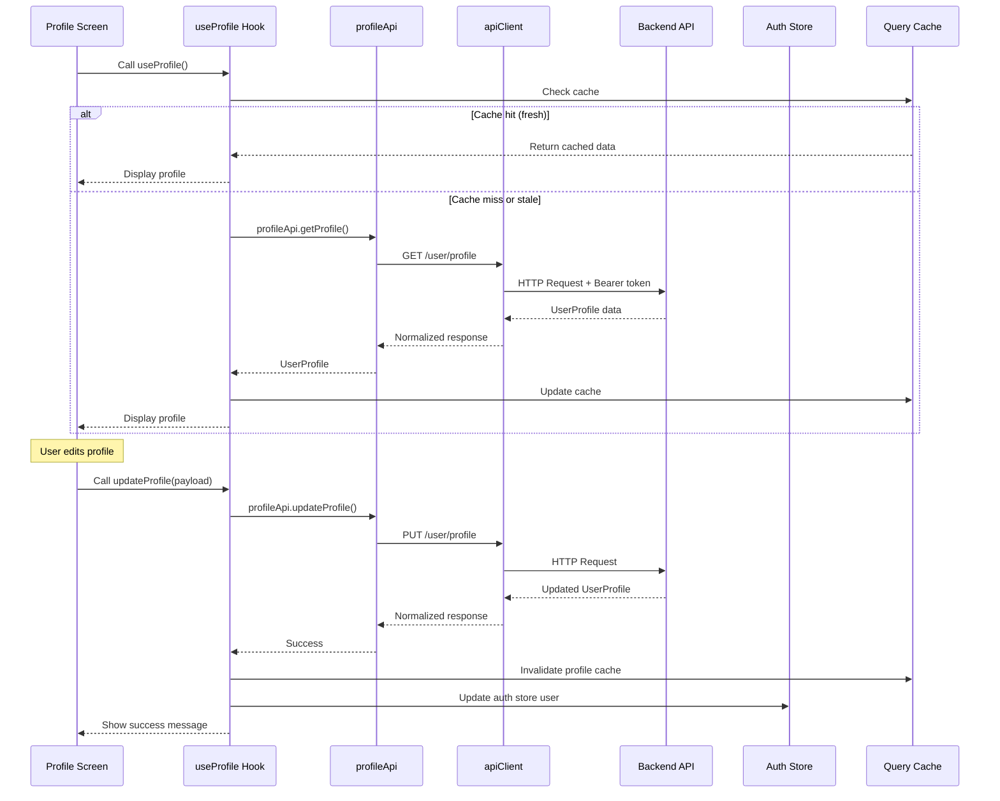

# Profile Screen Design Document

## Overview

The Profile Screen feature provides a centralized interface for users to view and manage their account settings, preferences, and profile information. This design follows the established Masqany mobile architecture with a two-layer state pattern: TanStack Query for server state (user profile data, settings) and Zustand for client state (authentication session).

The feature implements the standard module pattern with `modules/profile/` containing `api.ts`, `hooks.ts`, `types.ts`, and `index.ts`. All components use TanStack Query hooks for data access and never call the API client directly.

### Key Design Principles

1. **Two-Layer State Separation**: Server state (profile data, settings) managed by TanStack Query; client state (auth session) managed by Zustand
2. **Module Pattern Compliance**: All API calls through `modules/profile/api.ts`, all data access through `modules/profile/hooks.ts`
3. **Design Token Usage**: All styling uses tokens from `constants/tokens.ts` and NativeWind classes
4. **Single API Client**: All HTTP calls use the shared Axios instance from `lib/api/client.ts`
5. **Navigation Integration**: Uses Expo Router for screen navigation with proper type safety

## Architecture

### High-Level Component Structure

```
app/(tabs)/profile.tsx                    Main profile screen (tab navigator)
  ├─ ProfileHeader                        Avatar, name, email, edit button
  ├─ SettingsCardList                     Scrollable list of setting cards
  │   ├─ SettingsCard (Account)
  │   ├─ SettingsCard (Language)
  │   ├─ SettingsCard (Security)
  │   ├─ SettingsCard (Notifications)
  │   ├─ SettingsCard (Support)
  │   ├─ SettingsCard (Terms & Policies)
  │   └─ SettingsCard (Logout)
  └─ LoadingOverlay / ErrorBoundary

app/(profile)/                            Profile feature screens group
  ├─ edit-profile.tsx                     Edit profile form
  ├─ account-settings.tsx                 Account management
  ├─ language-preferences.tsx             Language selection
  ├─ security-settings.tsx                Password & 2FA
  ├─ notification-preferences.tsx         Notification toggles
  ├─ support.tsx                          Support resources
  └─ policies.tsx                         Terms & privacy viewer

modules/profile/                          Profile feature module
  ├─ api.ts                               API bindings
  ├─ hooks.ts                             TanStack Query hooks
  ├─ types.ts                             TypeScript interfaces
  └─ index.ts                             Public exports

components/profile/                       Reusable profile components
  ├─ ProfileHeader.tsx                    Avatar section component
  ├─ SettingsCard.tsx                     Individual setting card
  └─ ConfirmDialog.tsx                    Logout confirmation modal
```

### Module Architecture

The profile module follows the established pattern:

```typescript
modules/profile/
  api.ts      → profileApi object with methods (getProfile, updateProfile, etc.)
  hooks.ts    → TanStack Query hooks (useProfile, useUpdateProfile, etc.)
  types.ts    → TypeScript interfaces (UserProfile, ProfileUpdatePayload, etc.)
  index.ts    → Re-exports all public APIs
```

### State Management Strategy

**Server State (TanStack Query)**:
- User profile data (name, email, phone, avatar)
- Language preferences
- Notification preferences
- Security settings (2FA status)
- Account metadata (creation date, verification status)

**Client State (Zustand - Auth Store)**:
- Authentication session (access token, refresh token)
- Current user object (synchronized with server state)
- Multi-account management (account list, active account)

**State Synchronization**:
- When profile updates succeed, invalidate TanStack Query cache
- Update Auth Store user object to reflect changes
- Use optimistic updates for immediate UI feedback

## Data Models

### TypeScript Interfaces

```typescript
// modules/profile/types.ts

export interface UserProfile {
  id: string;
  name: string;
  email: string;
  phone?: string;
  avatar?: string;
  isHost: boolean;
  isVerified: boolean;
  createdAt: string;
  updatedAt: string;
  // Extended profile fields
  language: LanguageCode;
  notificationPreferences: NotificationPreferences;
  securitySettings: SecuritySettings;
}

export type LanguageCode = "en" | "sw"; // English, Kiswahili

export interface NotificationPreferences {
  pushEnabled: boolean;
  emailEnabled: boolean;
  bookingNotifications: boolean;
  chatNotifications: boolean;
  promotionalNotifications: boolean;
}

export interface SecuritySettings {
  twoFactorEnabled: boolean;
  twoFactorMethod?: "sms" | "email" | "authenticator";
  lastPasswordChange?: string;
}

export interface ProfileUpdatePayload {
  name?: string;
  email?: string;
  phone?: string;
  avatar?: string; // Base64 or URL
}

export interface LanguageUpdatePayload {
  language: LanguageCode;
}

export interface NotificationUpdatePayload {
  preferences: Partial<NotificationPreferences>;
}

export interface PasswordChangePayload {
  currentPassword: string;
  newPassword: string;
  confirmPassword: string;
}

export interface TwoFactorTogglePayload {
  enabled: boolean;
  method?: "sms" | "email" | "authenticator";
  verificationCode?: string;
}

export interface Account {
  id: string;
  name: string;
  email: string;
  role: "guest" | "host" | "admin";
  avatar?: string;
}

export interface MultiAccountState {
  accounts: Account[];
  activeAccountId: string;
}
```

### API Response Shapes

```typescript
// Success response
interface ApiResponse<T> {
  success: true;
  data: T;
  message?: string;
}

// Error response (normalized by apiClient)
interface ApiError {
  message: string;
  status: number | null;
  code: string | null;
}
```

## Components and Interfaces

### ProfileHeader Component

**Purpose**: Display user avatar, name, email, and edit button

**Props**:
```typescript
interface ProfileHeaderProps {
  user: UserProfile | null;
  isLoading: boolean;
  onEditPress: () => void;
}
```

**Styling**:
- Avatar: 80x80 circular image with border
- Edit icon: Positioned absolute top-right of avatar
- Name: Poppins SemiBold, size xl, color dark-400
- Email: Inter Regular, size base, color dark-100
- Background: Transparent over app-full-screen.webp
- Spacing: Uses tokens (spacing.lg, spacing.md)

### SettingsCard Component

**Purpose**: Reusable card for each settings option

**Props**:
```typescript
interface SettingsCardProps {
  icon: ImageSourcePropType;
  label: string;
  onPress: () => void;
  variant?: "default" | "danger"; // danger for logout
}
```

**Styling**:
- Background: #e1e6e8 (neutral card background)
- Border radius: radius.lg (14px)
- Padding: spacing.base (16px)
- Icon: 24x24, left aligned
- Label: Inter Medium, size base, color dark-400
- Chevron: 16x16, right aligned, color dark-100
- Danger variant: Red text and icon tint

### ConfirmDialog Component

**Purpose**: Modal confirmation for destructive actions (logout)

**Props**:
```typescript
interface ConfirmDialogProps {
  visible: boolean;
  title: string;
  message: string;
  confirmText: string;
  cancelText: string;
  onConfirm: () => void;
  onCancel: () => void;
  variant?: "default" | "danger";
}
```

## API Endpoints and Data Flow

### API Endpoints

```typescript
// modules/profile/api.ts

export const profileApi = {
  // Get current user profile
  getProfile: () =>
    apiClient.get<UserProfile>("/user/profile").then((r) => r.data),

  // Update profile information
  updateProfile: (payload: ProfileUpdatePayload) =>
    apiClient
      .put<UserProfile>("/user/profile", payload)
      .then((r) => r.data),

  // Upload avatar image
  uploadAvatar: (formData: FormData) =>
    apiClient
      .post<{ avatarUrl: string }>("/user/avatar", formData, {
        headers: { "Content-Type": "multipart/form-data" },
      })
      .then((r) => r.data),

  // Update language preference
  updateLanguage: (payload: LanguageUpdatePayload) =>
    apiClient
      .put<UserProfile>("/user/language", payload)
      .then((r) => r.data),

  // Update notification preferences
  updateNotifications: (payload: NotificationUpdatePayload) =>
    apiClient
      .put<NotificationPreferences>("/user/notifications", payload)
      .then((r) => r.data),

  // Change password
  changePassword: (payload: PasswordChangePayload) =>
    apiClient
      .post<{ success: boolean }>("/user/password/change", payload)
      .then((r) => r.data),

  // Toggle 2FA
  toggleTwoFactor: (payload: TwoFactorTogglePayload) =>
    apiClient
      .post<SecuritySettings>("/user/2fa/toggle", payload)
      .then((r) => r.data),

  // Get multi-account list
  getAccounts: () =>
    apiClient
      .get<MultiAccountState>("/user/accounts")
      .then((r) => r.data),

  // Switch account
  switchAccount: (accountId: string) =>
    apiClient
      .post<{ accessToken: string; refreshToken: string; user: UserProfile }>(
        "/user/accounts/switch",
        { accountId }
      )
      .then((r) => r.data),

  // Add new account
  addAccount: (credentials: { email: string; password: string }) =>
    apiClient
      .post<{ accessToken: string; refreshToken: string; user: UserProfile }>(
        "/user/accounts/add",
        credentials
      )
      .then((r) => r.data),

  // Logout
  logout: () =>
    apiClient.post<{ success: boolean }>("/auth/logout").then((r) => r.data),
};
```

### TanStack Query Hooks

```typescript
// modules/profile/hooks.ts

export const profileKeys = {
  all: ["profile"] as const,
  detail: () => [...profileKeys.all, "detail"] as const,
  notifications: () => [...profileKeys.all, "notifications"] as const,
  security: () => [...profileKeys.all, "security"] as const,
  accounts: () => [...profileKeys.all, "accounts"] as const,
};

// Get user profile
export function useProfile() {
  return useQuery({
    queryKey: profileKeys.detail(),
    queryFn: () => profileApi.getProfile(),
    staleTime: 1000 * 60 * 5, // 5 minutes
  });
}

// Update profile
export function useUpdateProfile() {
  const qc = useQueryClient();
  const { setUser } = useAuthStore();

  return useMutation({
    mutationFn: (payload: ProfileUpdatePayload) =>
      profileApi.updateProfile(payload),
    onSuccess: (data) => {
      qc.invalidateQueries({ queryKey: profileKeys.detail() });
      setUser(data); // Update auth store
    },
  });
}

// Upload avatar
export function useUploadAvatar() {
  const qc = useQueryClient();

  return useMutation({
    mutationFn: (formData: FormData) => profileApi.uploadAvatar(formData),
    onSuccess: () => {
      qc.invalidateQueries({ queryKey: profileKeys.detail() });
    },
  });
}

// Update language
export function useUpdateLanguage() {
  const qc = useQueryClient();

  return useMutation({
    mutationFn: (payload: LanguageUpdatePayload) =>
      profileApi.updateLanguage(payload),
    onSuccess: () => {
      qc.invalidateQueries({ queryKey: profileKeys.detail() });
      // TODO: Trigger i18n language change
    },
  });
}

// Update notifications
export function useUpdateNotifications() {
  const qc = useQueryClient();

  return useMutation({
    mutationFn: (payload: NotificationUpdatePayload) =>
      profileApi.updateNotifications(payload),
    onSuccess: () => {
      qc.invalidateQueries({ queryKey: profileKeys.notifications() });
    },
  });
}

// Change password
export function useChangePassword() {
  return useMutation({
    mutationFn: (payload: PasswordChangePayload) =>
      profileApi.changePassword(payload),
  });
}

// Toggle 2FA
export function useToggleTwoFactor() {
  const qc = useQueryClient();

  return useMutation({
    mutationFn: (payload: TwoFactorTogglePayload) =>
      profileApi.toggleTwoFactor(payload),
    onSuccess: () => {
      qc.invalidateQueries({ queryKey: profileKeys.security() });
    },
  });
}

// Get accounts
export function useAccounts() {
  return useQuery({
    queryKey: profileKeys.accounts(),
    queryFn: () => profileApi.getAccounts(),
    staleTime: 1000 * 60 * 10, // 10 minutes
  });
}

// Switch account
export function useSwitchAccount() {
  const qc = useQueryClient();
  const { setUser } = useAuthStore();
  const { setTokens } = tokenStore.getState();

  return useMutation({
    mutationFn: (accountId: string) => profileApi.switchAccount(accountId),
    onSuccess: (data) => {
      setTokens(data.accessToken, data.refreshToken);
      setUser(data.user);
      qc.invalidateQueries(); // Invalidate all queries
    },
  });
}

// Add account
export function useAddAccount() {
  const qc = useQueryClient();

  return useMutation({
    mutationFn: (credentials: { email: string; password: string }) =>
      profileApi.addAccount(credentials),
    onSuccess: () => {
      qc.invalidateQueries({ queryKey: profileKeys.accounts() });
    },
  });
}

// Logout
export function useLogout() {
  const qc = useQueryClient();
  const { clearSession } = useAuthStore();
  const { clearTokens } = tokenStore.getState();

  return useMutation({
    mutationFn: () => profileApi.logout(),
    onSuccess: () => {
      clearTokens();
      clearSession();
      qc.clear(); // Clear all cached data
    },
  });
}
```

### Data Flow Diagram



## Navigation Structure

### Route Definitions

```typescript
// app/(tabs)/profile.tsx - Main profile screen (tab)
// app/(profile)/_layout.tsx - Profile group layout
// app/(profile)/edit-profile.tsx
// app/(profile)/account-settings.tsx
// app/(profile)/language-preferences.tsx
// app/(profile)/security-settings.tsx
// app/(profile)/notification-preferences.tsx
// app/(profile)/support.tsx
// app/(profile)/policies.tsx
```

### Navigation Flow

```
Profile Tab (profile.tsx)
  ├─ Edit Profile → (profile)/edit-profile
  ├─ Account Settings → (profile)/account-settings
  ├─ Language → (profile)/language-preferences
  ├─ Security → (profile)/security-settings
  │   └─ Change Password → (profile)/change-password
  ├─ Notifications → (profile)/notification-preferences
  ├─ Support → (profile)/support
  ├─ Terms & Policies → (profile)/policies
  │   ├─ Terms of Service
  │   └─ Privacy Policy
  └─ Logout → Confirm Dialog → Auth Screen
```

### Navigation Implementation

```typescript
// In profile.tsx
import { router } from "expo-router";

const handleEditProfile = () => {
  router.push("/(profile)/edit-profile");
};

const handleAccountSettings = () => {
  router.push("/(profile)/account-settings");
};

// etc.
```

## Styling Approach

### Design Token Usage

All styling uses tokens from `constants/tokens.ts`:

```typescript
import { colors, typography, spacing, radius, shadow } from "@/constants/tokens";

// Example: ProfileHeader styles
const styles = StyleSheet.create({
  container: {
    paddingHorizontal: spacing.lg,
    paddingVertical: spacing.xl,
    alignItems: "center",
  },
  avatar: {
    width: 80,
    height: 80,
    borderRadius: radius.full,
    borderWidth: 3,
    borderColor: colors.primary[700],
  },
  name: {
    fontFamily: typography.family.headingSemiBold,
    fontSize: typography.size.xl,
    color: colors.dark[400],
    marginTop: spacing.md,
  },
  email: {
    fontFamily: typography.family.regular,
    fontSize: typography.size.base,
    color: colors.dark[100],
    marginTop: spacing.xs,
  },
});
```

### NativeWind Classes

For components that support className:

```tsx
<View className="px-5 py-6 bg-[#e1e6e8] rounded-lg flex-row items-center">
  <Image source={icon} className="w-6 h-6" />
  <Text className="flex-1 ml-3 font-inter-medium text-base text-dark-400">
    {label}
  </Text>
  <Image source={chevron} className="w-4 h-4" />
</View>
```

### Component-Specific Styling

**SettingsCard**:
- Background: `#e1e6e8`
- Border radius: `14px` (radius.lg)
- Padding: `16px` (spacing.base)
- Margin bottom: `12px` (spacing.md)
- Shadow: `shadow.sm`

**ProfileHeader**:
- Avatar size: `80x80`
- Avatar border: `3px solid primary-700`
- Edit icon: `24x24`, positioned absolute
- Spacing between elements: `spacing.md`

**Screen Layout**:
- Background: ImageBackground with `app-full-screen.webp`
- SafeAreaView with edges: `["top", "left", "right"]`
- ScrollView with `paddingBottom: 100` (tab bar clearance)
- Content padding: `spacing.lg` horizontal

## Error Handling

### Error States

1. **Network Errors**: Display retry button with error message
2. **Validation Errors**: Show field-specific error messages
3. **Authentication Errors**: Redirect to login screen
4. **Server Errors**: Display generic error message with support link

### Error Handling Strategy

```typescript
// In components
const { data, isLoading, error, refetch } = useProfile();

if (error) {
  return (
    <ErrorView
      message={error.message}
      onRetry={refetch}
    />
  );
}

// In mutations
const updateProfile = useUpdateProfile();

const handleSave = async () => {
  try {
    await updateProfile.mutateAsync(formData);
    Alert.alert("Success", "Profile updated successfully");
    router.back();
  } catch (error) {
    Alert.alert("Error", error.message || "Failed to update profile");
  }
};
```

### Error Boundary

```typescript
// components/ErrorBoundary.tsx
export class ErrorBoundary extends React.Component {
  state = { hasError: false, error: null };

  static getDerivedStateFromError(error) {
    return { hasError: true, error };
  }

  render() {
    if (this.state.hasError) {
      return <ErrorFallback error={this.state.error} />;
    }
    return this.props.children;
  }
}
```

## Loading States

### Loading Indicators

1. **Initial Load**: Full-screen loading spinner
2. **Mutation Loading**: Button loading state (disabled + spinner)
3. **Optimistic Updates**: Immediate UI update, revert on error
4. **Skeleton Screens**: For profile header during load

### Loading State Implementation

```typescript
// Profile screen
const { data: profile, isLoading } = useProfile();

if (isLoading) {
  return <ProfileSkeleton />;
}

// Mutation loading
const updateProfile = useUpdateProfile();

<Button
  onPress={handleSave}
  disabled={updateProfile.isPending}
>
  {updateProfile.isPending ? <ActivityIndicator /> : "Save"}
</Button>
```

### Skeleton Component

```typescript
// components/profile/ProfileSkeleton.tsx
export function ProfileSkeleton() {
  return (
    <View className="items-center py-6">
      <View className="w-20 h-20 rounded-full bg-light-200 animate-pulse" />
      <View className="w-32 h-6 mt-3 rounded bg-light-200 animate-pulse" />
      <View className="w-48 h-4 mt-2 rounded bg-light-200 animate-pulse" />
    </View>
  );
}
```

## Testing Strategy

This feature is primarily UI-focused with straightforward CRUD operations and navigation flows. Property-based testing is **not applicable** here because:

1. **UI Rendering**: The profile screen is primarily about displaying and editing user data through forms and navigation
2. **Simple CRUD**: Profile updates are basic create/read/update operations with no complex business logic
3. **Navigation**: Screen transitions and routing don't benefit from property-based testing
4. **Configuration**: Settings toggles and preferences are simple state changes

### Recommended Testing Approach

**Unit Tests** (Jest + React Native Testing Library):
- Component rendering with different props
- Form validation logic
- Button press handlers
- Navigation calls
- Error state rendering
- Loading state rendering

**Integration Tests**:
- Profile data fetching and display
- Profile update flow (form → API → cache invalidation)
- Logout flow (confirmation → API → navigation)
- Language preference persistence
- Multi-account switching

**Example Unit Tests**:

```typescript
describe("ProfileHeader", () => {
  it("displays user name and email", () => {
    const user = { name: "John Doe", email: "john@example.com" };
    const { getByText } = render(<ProfileHeader user={user} />);
    expect(getByText("John Doe")).toBeTruthy();
    expect(getByText("john@example.com")).toBeTruthy();
  });

  it("shows loading state when isLoading is true", () => {
    const { getByTestId } = render(<ProfileHeader isLoading={true} />);
    expect(getByTestId("loading-indicator")).toBeTruthy();
  });

  it("calls onEditPress when edit button is pressed", () => {
    const onEditPress = jest.fn();
    const { getByTestId } = render(
      <ProfileHeader user={mockUser} onEditPress={onEditPress} />
    );
    fireEvent.press(getByTestId("edit-button"));
    expect(onEditPress).toHaveBeenCalled();
  });
});

describe("SettingsCard", () => {
  it("renders with correct label and icon", () => {
    const { getByText } = render(
      <SettingsCard label="Account Settings" icon={accountIcon} />
    );
    expect(getByText("Account Settings")).toBeTruthy();
  });

  it("applies danger variant styling for logout", () => {
    const { getByText } = render(
      <SettingsCard label="Logout" variant="danger" />
    );
    const text = getByText("Logout");
    expect(text.props.style).toContainEqual({ color: colors.danger });
  });
});

describe("useProfile hook", () => {
  it("fetches profile data on mount", async () => {
    const { result } = renderHook(() => useProfile());
    await waitFor(() => expect(result.current.isSuccess).toBe(true));
    expect(result.current.data).toEqual(mockProfile);
  });

  it("handles error state", async () => {
    server.use(
      rest.get("/user/profile", (req, res, ctx) => {
        return res(ctx.status(500), ctx.json({ message: "Server error" }));
      })
    );
    const { result } = renderHook(() => useProfile());
    await waitFor(() => expect(result.current.isError).toBe(true));
    expect(result.current.error.message).toBe("Server error");
  });
});

describe("Logout flow", () => {
  it("shows confirmation dialog before logout", () => {
    const { getByText } = render(<ProfileScreen />);
    fireEvent.press(getByText("Logout"));
    expect(getByText("Are you sure you want to log out?")).toBeTruthy();
  });

  it("clears session and navigates to auth on confirm", async () => {
    const { getByText } = render(<ProfileScreen />);
    fireEvent.press(getByText("Logout"));
    fireEvent.press(getByText("Confirm"));
    await waitFor(() => {
      expect(mockRouter.replace).toHaveBeenCalledWith("/auth");
      expect(useAuthStore.getState().user).toBeNull();
    });
  });
});
```

**E2E Tests** (Detox - optional):
- Complete profile edit flow
- Language switching with UI update
- Multi-account switching
- Logout and re-login

### Test Coverage Goals

- Unit tests: 80%+ coverage for components and hooks
- Integration tests: Cover all critical user flows
- E2E tests: Cover happy path for main features

---

## Implementation Checklist

### Phase 1: Module Setup
- [ ] Create `modules/profile/` directory
- [ ] Implement `types.ts` with all interfaces
- [ ] Implement `api.ts` with all endpoints
- [ ] Implement `hooks.ts` with TanStack Query hooks
- [ ] Create `index.ts` with re-exports

### Phase 2: Reusable Components
- [ ] Create `components/profile/ProfileHeader.tsx`
- [ ] Create `components/profile/SettingsCard.tsx`
- [ ] Create `components/profile/ConfirmDialog.tsx`
- [ ] Create `components/profile/ProfileSkeleton.tsx`
- [ ] Create `components/profile/ErrorView.tsx`

### Phase 3: Main Profile Screen
- [ ] Update `app/(tabs)/profile.tsx` with full implementation
- [ ] Integrate ProfileHeader component
- [ ] Implement SettingsCardList with all cards
- [ ] Add logout confirmation dialog
- [ ] Handle loading and error states

### Phase 4: Profile Sub-Screens
- [ ] Create `app/(profile)/_layout.tsx`
- [ ] Implement `edit-profile.tsx`
- [ ] Implement `account-settings.tsx`
- [ ] Implement `language-preferences.tsx`
- [ ] Implement `security-settings.tsx`
- [ ] Implement `notification-preferences.tsx`
- [ ] Implement `support.tsx`
- [ ] Implement `policies.tsx`

### Phase 5: Testing
- [ ] Write unit tests for components
- [ ] Write unit tests for hooks
- [ ] Write integration tests for flows
- [ ] Manual testing on iOS and Android
- [ ] Accessibility testing

### Phase 6: Polish
- [ ] Add loading animations
- [ ] Add success/error toasts
- [ ] Optimize images and icons
- [ ] Test offline behavior
- [ ] Performance optimization

---

## Future Enhancements

1. **Profile Completion Progress**: Show percentage of profile completion
2. **Avatar Cropping**: In-app image cropping for avatar uploads
3. **Biometric Authentication**: Face ID / Touch ID for security
4. **Activity Log**: View recent account activity
5. **Data Export**: Allow users to export their data
6. **Account Deletion**: Self-service account deletion flow
7. **Theme Preferences**: Light/dark mode toggle
8. **Accessibility Settings**: Font size, contrast adjustments
9. **Privacy Controls**: Granular privacy settings
10. **Social Connections**: Link social media accounts

---

## Dependencies

### Required Packages (Already Installed)
- `@tanstack/react-query` - Server state management
- `zustand` - Client state management
- `axios` - HTTP client
- `expo-router` - Navigation
- `expo-image-picker` - Avatar upload
- `react-native-safe-area-context` - Safe area handling
- `nativewind` - Tailwind CSS for React Native

### New Dependencies (If Needed)
- `react-native-modal` - For confirmation dialogs (or use built-in Modal)
- `expo-secure-store` - For secure token storage (if not already used)
- `i18n-js` - For internationalization (English/Kiswahili)

---

## Conclusion

This design document provides a comprehensive blueprint for implementing the Profile Screen feature in the Masqany mobile app. It follows the established architecture patterns, maintains consistency with existing code, and provides clear guidance for implementation.

The design prioritizes:
- **Maintainability**: Clear separation of concerns with module pattern
- **Performance**: Optimized caching with TanStack Query
- **User Experience**: Smooth navigation, loading states, error handling
- **Scalability**: Easy to extend with new settings and preferences
- **Type Safety**: Full TypeScript coverage with strict interfaces

Next steps: Proceed to task creation phase to break down implementation into actionable tasks.
