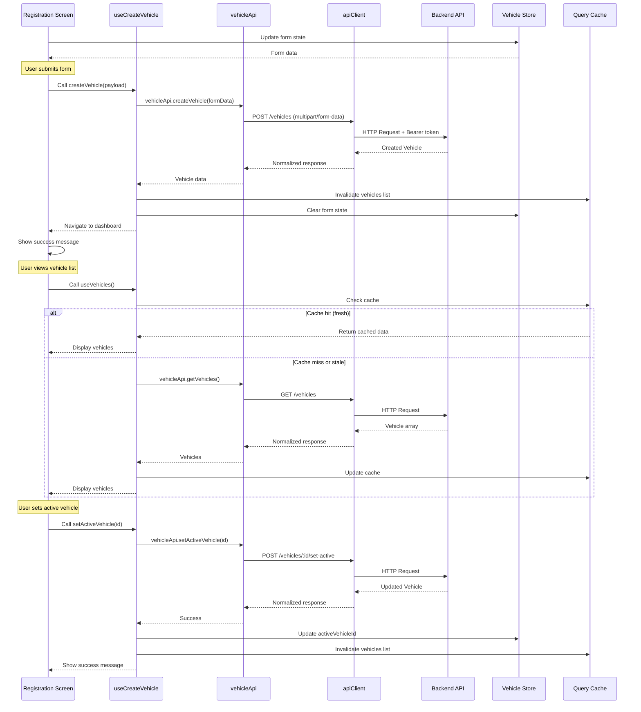

# Vehicle Management Module Design Document

## Overview

The Vehicle Management Module provides a comprehensive system for drivers to register, manage, and maintain their vehicles for providing relocation services on the Masqany platform. This design follows the established Masqany mobile architecture with a two-layer state pattern: TanStack Query for server state (vehicle data, documents, verification status) and Zustand for client state (UI interactions, form state, active vehicle selection).

The feature implements the standard module pattern with `modules/vehicle/` containing `api.ts`, `hooks.ts`, `types.ts`, and `index.ts`. All components use TanStack Query hooks for data access and never call the API client directly. The module integrates with the Auth Module for user identity and role-based access control, supporting Driver, Admin, and Super Admin roles.

### Key Design Principles

1. **Two-Layer State Separation**: Server state (vehicles, documents, verification) managed by TanStack Query; client state (form inputs, UI toggles) managed by Zustand
2. **Module Pattern Compliance**: All API calls through `modules/vehicle/api.ts`, all data access through `modules/vehicle/hooks.ts`
3. **Design Token Usage**: All styling uses tokens from `constants/tokens.ts` and NativeWind classes
4. **Single API Client**: All HTTP calls use the shared Axios instance from `lib/api/client.ts`
5. **Navigation Integration**: Uses Expo Router for screen navigation with proper type safety
6. **Role-Based Access Control**: Enforces permissions for Driver, Admin, and Super Admin roles
7. **Document Management**: Handles multi-file uploads with validation and expiration tracking
8. **Kenyan Standards**: Implements Kenyan license plate validation and service zone selection

## Architecture

### High-Level Component Structure

```
app/(registration)/vehicle-registration.tsx    Vehicle registration screen
  ├─ GradientHeader                            30% non-scrollable gradient header
  │   ├─ BackButton                            White circle back button
  │   ├─ VerificationBadge                     Pre-verified/verified status
  │   ├─ HeaderTitle                           "Become a Verified Masqany Mover"
  │   └─ HeaderSubtext                         "complete your profile to unlock trips"
  └─ ScrollableCard                            70% white scrollable form card
      ├─ ProfessionalProfileHeading            "Professional Profile" heading
      ├─ VehicleRegistrationForm               All form fields
      │   ├─ FullNameInput                     Legal name with user icon
      │   ├─ DateOfBirthInput                  Date picker with calendar icon
      │   ├─ GenderSelector                    Gender dropdown with icon
      │   ├─ PhoneNumberDisplay                Imported from Auth (verified)
      │   ├─ EmailDisplay                      Imported from Auth (verified)
      │   ├─ VehicleTypeSelector               Pickup/Truck/Mini Truck
      │   ├─ PlateNumberInput                  KEA 100Q format validation
      │   ├─ CapacityInput                     50-10000 kg with unit selector
      │   ├─ NationalIdInput                   ID number with icon
      │   ├─ DocumentUploadSection             Insurance, license, inspection
      │   ├─ PhotoUploadSection                3-10 vehicle photos
      │   ├─ PaymentMethodSelector             M-Pesa/Bank/Cash
      │   └─ ServiceZoneSelector               Multi-select Kenyan cities
      ├─ TermsCheckbox                         Terms acceptance checkbox
      └─ SubmitButton                          "Complete Registration and Start"

app/(vehicle)/                                 Vehicle management screens group
  ├─ vehicle-list.tsx                          List of driver's vehicles
  │   ├─ SearchBar                             Search by plate/type
  │   ├─ FilterButtons                         Type and status filters
  │   └─ VehicleCardList                       Scrollable vehicle cards
  │       └─ VehicleCard                       Plate, type, status, active badge
  ├─ vehicle-details.tsx                       Single vehicle details
  │   ├─ VehicleHeader                         Plate, type, verification badge
  │   ├─ VehicleInfoSection                    All vehicle data fields
  │   ├─ DocumentSection                       Document thumbnails with view
  │   ├─ PhotoGallery                          Vehicle photos grid
  │   ├─ StatusToggle                          Available/unavailable toggle
  │   ├─ HistoryTimeline                       Vehicle event history
  │   └─ ActionButtons                         Edit, Delete, Set Active
  ├─ edit-vehicle.tsx                          Edit vehicle form
  └─ vehicle-history.tsx                       Detailed history view

app/(admin)/                                   Admin screens group
  ├─ admin-vehicles.tsx                        All vehicles pending review
  │   └─ AdminVehicleCard                      Driver, plate, registration date
  └─ admin-vehicle-review.tsx                  Vehicle review screen
      ├─ DriverInfoSection                     Driver details
      ├─ VehicleInfoSection                    Vehicle data
      ├─ DocumentReviewSection                 Document viewer with zoom
      ├─ PhotoReviewSection                    Photo gallery
      ├─ RejectionReasonInput                  Rejection reason textarea
      └─ ApprovalButtons                       Approve/Reject buttons

modules/vehicle/                               Vehicle feature module
  ├─ api.ts                                    API bindings
  ├─ hooks.ts                                  TanStack Query hooks
  ├─ types.ts                                  TypeScript interfaces
  ├─ store.ts                                  Zustand client state
  └─ index.ts                                  Public exports

components/vehicle/                            Reusable vehicle components
  ├─ VehicleCard.tsx                           Vehicle list card
  ├─ VehicleHeader.tsx                         Vehicle details header
  ├─ DocumentUpload.tsx                        Document upload component
  ├─ PhotoUpload.tsx                           Photo upload component
  ├─ PlateNumberInput.tsx                      License plate input with validation
  ├─ CapacityInput.tsx                         Capacity input with unit selector
  ├─ ServiceZoneSelector.tsx                   Multi-select city chips
  ├─ PaymentMethodSelector.tsx                 Payment method configuration
  ├─ StatusBadge.tsx                           Vehicle status indicator
  ├─ VerificationBadge.tsx                     Verification status badge
  ├─ HistoryTimeline.tsx                       Event history timeline
  └─ VehicleSkeleton.tsx                       Loading skeleton
```

### Module Architecture

The vehicle module follows the established pattern:

```typescript
modules/vehicle/
  api.ts      → vehicleApi object with methods (createVehicle, getVehicles, etc.)
  hooks.ts    → TanStack Query hooks (useVehicles, useCreateVehicle, etc.)
  types.ts    → TypeScript interfaces (Vehicle, VehicleDocument, VehicleStatus, etc.)
  store.ts    → Zustand store for client state (form state, UI toggles)
  index.ts    → Re-exports all public APIs
```

### State Management Strategy

**Server State (TanStack Query)**:
- Vehicle list (driver's vehicles)
- Vehicle details (single vehicle data)
- Vehicle documents (insurance, license, inspection)
- Vehicle photos
- Vehicle history (event timeline)
- Admin vehicles list (pending verification)
- Document expiration tracking

**Client State (Zustand - Vehicle Store)**:
- Registration form state (temporary form data)
- Active vehicle selection (UI state)
- Search and filter state (client-side filtering)
- Document upload progress
- Photo upload progress
- Modal visibility states

**State Synchronization**:
- When vehicle operations succeed, invalidate TanStack Query cache
- Update Vehicle Store active vehicle when set active succeeds
- Use optimistic updates for status changes
- Clear form state after successful registration

## Data Models

### TypeScript Interfaces

```typescript
// modules/vehicle/types.ts

export type VehicleType = "truck" | "mini_truck" | "pickup";

export type VehicleStatus = 
  | "available" 
  | "unavailable" 
  | "in_service" 
  | "under_maintenance";

export type VerificationStatus = 
  | "pending_verification" 
  | "verified" 
  | "rejected";

export type DocumentType = 
  | "insurance" 
  | "driving_license" 
  | "inspection_certificate";

export type PaymentMethod = "mpesa" | "bank_transfer" | "cash";

export interface Vehicle {
  id: string;
  driverId: string;
  driverName: string;
  dateOfBirth: string;
  gender: "male" | "female" | "other";
  phone: string;
  email: string;
  vehicleType: VehicleType;
  plateNumber: string;
  capacity: number;
  capacityUnit: "kg" | "cubic_meters";
  nationalId: string;
  insuranceDocumentUrl: string;
  insuranceExpirationDate?: string;
  drivingLicenseUrl: string;
  inspectionCertificateUrl?: string;
  inspectionExpirationDate?: string;
  photos: string[]; // Array of photo URLs
  paymentMethod: PaymentMethod;
  paymentDetails: PaymentDetails;
  serviceZones: string[]; // Array of city names
  status: VehicleStatus;
  verificationStatus: VerificationStatus;
  rejectionReason?: string;
  isActive: boolean; // Is this the driver's active vehicle
  createdAt: string;
  updatedAt: string;
  deletedAt?: string;
}

export interface PaymentDetails {
  mpesaNumber?: string;
  bankName?: string;
  accountNumber?: string;
  accountName?: string;
}

export interface VehicleDocument {
  id: string;
  vehicleId: string;
  type: DocumentType;
  url: string;
  expirationDate?: string;
  uploadedAt: string;
}

export interface VehiclePhoto {
  id: string;
  vehicleId: string;
  url: string;
  uploadedAt: string;
}

export interface VehicleHistoryEvent {
  id: string;
  vehicleId: string;
  eventType: 
    | "created" 
    | "verified" 
    | "rejected" 
    | "status_changed" 
    | "document_updated" 
    | "assignment_completed"
    | "set_active"
    | "set_inactive";
  description: string;
  performedBy: string; // User ID or "system"
  performedByName?: string; // Admin name for verification events
  metadata?: Record<string, any>;
  timestamp: string;
}

export interface VehicleRegistrationPayload {
  driverName: string;
  dateOfBirth: string;
  gender: "male" | "female" | "other";
  vehicleType: VehicleType;
  plateNumber: string;
  capacity: number;
  capacityUnit: "kg" | "cubic_meters";
  nationalId: string;
  insuranceDocument: File | { uri: string; type: string; name: string };
  insuranceExpirationDate?: string;
  drivingLicense: File | { uri: string; type: string; name: string };
  inspectionCertificate?: File | { uri: string; type: string; name: string };
  inspectionExpirationDate?: string;
  photos: Array<File | { uri: string; type: string; name: string }>;
  paymentMethod: PaymentMethod;
  paymentDetails: PaymentDetails;
  serviceZones: string[];
}

export interface VehicleUpdatePayload {
  capacity?: number;
  capacityUnit?: "kg" | "cubic_meters";
  serviceZones?: string[];
  paymentMethod?: PaymentMethod;
  paymentDetails?: PaymentDetails;
  photos?: Array<File | { uri: string; type: string; name: string }>;
}

export interface VehicleStatusUpdatePayload {
  status: VehicleStatus;
}

export interface AdminApprovalPayload {
  approved: boolean;
  rejectionReason?: string;
}

export interface VehicleFilters {
  vehicleType?: VehicleType;
  status?: VehicleStatus;
  verificationStatus?: VerificationStatus;
  searchQuery?: string;
}

export interface DocumentExpirationWarning {
  vehicleId: string;
  plateNumber: string;
  documentType: DocumentType;
  expirationDate: string;
  daysUntilExpiration: number;
  isExpired: boolean;
}
```

### API Response Shapes

```typescript
// Success response
interface ApiResponse<T> {
  success: true;
  data: T;
  message?: string;
}

// Error response (normalized by apiClient)
interface ApiError {
  message: string;
  status: number | null;
  code: string | null;
  fieldErrors?: Record<string, string>;
}

// Paginated response
interface PaginatedResponse<T> {
  data: T[];
  pagination: {
    page: number;
    pageSize: number;
    total: number;
    totalPages: number;
  };
}
```


## Components and Interfaces

### VehicleCard Component

**Purpose**: Display vehicle summary in list view

**Props**:
```typescript
interface VehicleCardProps {
  vehicle: Vehicle;
  onPress: () => void;
  onSetActive?: () => void;
  showActions?: boolean;
}
```

**Styling**:
- Background: `#e1e6e8` (neutral card background)
- Border radius: `radius.lg` (14px)
- Padding: `spacing.base` (16px)
- Margin bottom: `spacing.md` (12px)
- Shadow: `shadow.sm`
- Active badge: Gradient from `#5de0e6` to `#004aad`
- Status badge: Color-coded (available: success, unavailable: dark-100, in_service: primary-700, under_maintenance: warning)
- Verification badge: verified (success), pending (warning), rejected (danger)

### GradientHeader Component

**Purpose**: 30% non-scrollable header with gradient background

**Props**:
```typescript
interface GradientHeaderProps {
  title: string;
  subtitle: string;
  isVerified: boolean;
  onBack: () => void;
}
```

**Styling**:
- Height: 30% of screen height
- Gradient: Linear 90deg from `#5de0e6` to `#004aad`
- Background image: `app-full-screen.webp`
- Back button: White circle with shadow
- Verification badge: Gradient from `#a6a6a6` to `#ffffff`
- Title: Poppins Bold, white, size 2xl
- Subtitle: Inter Regular, white, size sm
- Vehicle icon: Positioned right of title

### PlateNumberInput Component

**Purpose**: License plate input with Kenyan format validation

**Props**:
```typescript
interface PlateNumberInputProps {
  value: string;
  onChangeText: (text: string) => void;
  error?: string;
}
```

**Validation**:
- Pattern: `/^[A-Z]{3}\s\d{3}[A-Z]$/`
- Examples: KEA 100Q, KEB 211Z, KCA 500A
- Auto-uppercase transformation
- Real-time validation feedback
- Error message: "Invalid plate format. Use format: KEA 100Q"

**Styling**:
- Blue border: `primary-700`
- License plate icon on left
- Black text: `dark-400`
- Error text: `danger` color
- Border radius: `radius.md`

### CapacityInput Component

**Purpose**: Capacity input with unit selector and validation

**Props**:
```typescript
interface CapacityInputProps {
  value: number;
  unit: "kg" | "cubic_meters";
  onChangeValue: (value: number) => void;
  onChangeUnit: (unit: "kg" | "cubic_meters") => void;
  error?: string;
}
```

**Validation**:
- Minimum: 50 kg
- Maximum: 10000 kg
- Numeric input only
- Error messages: "Minimum capacity is 50 kg", "Maximum capacity is 10000 kg"

**Styling**:
- Split input: numeric field + unit selector
- Weight icon on left
- Blue borders
- Unit selector: Segmented control style

### DocumentUpload Component

**Purpose**: Document upload with file picker and validation

**Props**:
```typescript
interface DocumentUploadProps {
  label: string;
  documentType: DocumentType;
  value?: string; // URL of uploaded document
  onUpload: (file: File | { uri: string; type: string; name: string }) => void;
  onRemove?: () => void;
  expirationDate?: string;
  onExpirationDateChange?: (date: string) => void;
  required?: boolean;
  error?: string;
}
```

**Features**:
- Opens device image picker (camera or library)
- Accepts: JPEG, PNG, PDF
- Max file size: 10MB
- Shows upload progress
- Displays success indicator with document name
- Optional expiration date picker
- Shows expiration warning badge if within 30 days

**Styling**:
- Dashed border when empty
- Solid border with success color when uploaded
- Document icon or thumbnail preview
- Upload progress bar
- Expiration warning badge: warning color

### PhotoUpload Component

**Purpose**: Multiple photo upload with grid display

**Props**:
```typescript
interface PhotoUploadProps {
  photos: string[]; // Array of photo URLs
  onAddPhoto: (file: File | { uri: string; type: string; name: string }) => void;
  onRemovePhoto: (index: number) => void;
  minPhotos?: number;
  maxPhotos?: number;
  error?: string;
}
```

**Features**:
- Grid layout for photo thumbnails
- Add photo button
- Delete button on each thumbnail
- Minimum 3 photos required
- Maximum 10 photos allowed
- Max 5MB per photo
- Accepts: JPEG, PNG, HEIC

**Styling**:
- Grid: 3 columns
- Thumbnail size: 100x100
- Border radius: `radius.md`
- Add button: Dashed border, camera icon
- Delete button: Absolute positioned, danger color

### ServiceZoneSelector Component

**Purpose**: Multi-select city chips for service zones

**Props**:
```typescript
interface ServiceZoneSelectorProps {
  selectedZones: string[];
  onToggleZone: (zone: string) => void;
  error?: string;
}
```

**Available Zones**:
- Nairobi
- Mombasa
- Kisumu
- Nakuru
- Eldoret
- (Extensible list)

**Features**:
- Multi-select with chips
- Selected chips: Primary color background
- Unselected chips: Light gray background
- Remove icon on selected chips
- Minimum 1 zone required

**Styling**:
- Chip: Rounded pill shape
- Selected: `primary-700` background, white text
- Unselected: `light-200` background, `dark-400` text
- Spacing: `spacing.sm` between chips
- Wrap layout

### PaymentMethodSelector Component

**Purpose**: Payment method configuration with conditional fields

**Props**:
```typescript
interface PaymentMethodSelectorProps {
  method: PaymentMethod;
  details: PaymentDetails;
  onMethodChange: (method: PaymentMethod) => void;
  onDetailsChange: (details: PaymentDetails) => void;
  errors?: Record<string, string>;
}
```

**Features**:
- Radio buttons for method selection
- Conditional fields based on selection:
  - M-Pesa: Phone number input (+254XXXXXXXXX)
  - Bank Transfer: Bank name, account number, account name
  - Cash: No additional fields
- Validation for M-Pesa number format
- Validation for bank account number

**Styling**:
- Radio buttons: Primary color when selected
- Conditional fields: Slide in animation
- Payment icons for each method
- Blue borders on inputs

### StatusBadge Component

**Purpose**: Visual indicator for vehicle status

**Props**:
```typescript
interface StatusBadgeProps {
  status: VehicleStatus;
  size?: "sm" | "md" | "lg";
}
```

**Status Colors**:
- available: `success` (#22C55E)
- unavailable: `dark-100` (#4F5C62)
- in_service: `primary-700` (#20A6FD)
- under_maintenance: `warning` (#F59E0B)

**Styling**:
- Pill shape with rounded corners
- Status text: Capitalized
- Icon: Dot indicator
- Size variants: sm (12px text), md (15px text), lg (17px text)

### VerificationBadge Component

**Purpose**: Visual indicator for verification status

**Props**:
```typescript
interface VerificationBadgeProps {
  status: VerificationStatus;
  size?: "sm" | "md" | "lg";
}
```

**Status Colors**:
- verified: `success` with checkmark icon
- pending_verification: `warning` with clock icon
- rejected: `danger` with X icon

**Styling**:
- Pill shape with rounded corners
- Status text: "Verified", "Pending", "Rejected"
- Icon on left
- Gradient background for verified status

### HistoryTimeline Component

**Purpose**: Display vehicle event history as timeline

**Props**:
```typescript
interface HistoryTimelineProps {
  events: VehicleHistoryEvent[];
  isLoading?: boolean;
}
```

**Features**:
- Chronological display (most recent first)
- Event icon based on type
- Event description
- Timestamp (relative: "2 hours ago")
- Performer name for admin actions
- Vertical line connecting events

**Styling**:
- Timeline line: `light-200` color, 2px width
- Event dot: Color-coded by event type
- Event card: White background, shadow
- Timestamp: `dark-100` color, size sm
- Description: `dark-400` color, size base


## API Endpoints and Data Flow

### API Endpoints

```typescript
// modules/vehicle/api.ts

export const vehicleApi = {
  // Create new vehicle registration
  createVehicle: (payload: FormData) =>
    apiClient
      .post<Vehicle>("/vehicles", payload, {
        headers: { "Content-Type": "multipart/form-data" },
      })
      .then((r) => r.data),

  // Get all vehicles for authenticated driver
  getVehicles: (filters?: VehicleFilters) =>
    apiClient
      .get<Vehicle[]>("/vehicles", { params: filters })
      .then((r) => r.data),

  // Get single vehicle by ID
  getVehicle: (id: string) =>
    apiClient
      .get<Vehicle>(`/vehicles/${id}`)
      .then((r) => r.data),

  // Update vehicle information
  updateVehicle: (id: string, payload: FormData) =>
    apiClient
      .put<Vehicle>(`/vehicles/${id}`, payload, {
        headers: { "Content-Type": "multipart/form-data" },
      })
      .then((r) => r.data),

  // Delete vehicle (soft delete)
  deleteVehicle: (id: string) =>
    apiClient
      .delete<{ success: boolean }>(`/vehicles/${id}`)
      .then((r) => r.data),

  // Set vehicle as active
  setActiveVehicle: (id: string) =>
    apiClient
      .post<Vehicle>(`/vehicles/${id}/set-active`)
      .then((r) => r.data),

  // Update vehicle status
  updateVehicleStatus: (id: string, payload: VehicleStatusUpdatePayload) =>
    apiClient
      .patch<Vehicle>(`/vehicles/${id}/status`, payload)
      .then((r) => r.data),

  // Get vehicle history
  getVehicleHistory: (id: string) =>
    apiClient
      .get<VehicleHistoryEvent[]>(`/vehicles/${id}/history`)
      .then((r) => r.data),

  // Upload additional photos
  uploadPhotos: (id: string, formData: FormData) =>
    apiClient
      .post<{ photoUrls: string[] }>(`/vehicles/${id}/photos`, formData, {
        headers: { "Content-Type": "multipart/form-data" },
      })
      .then((r) => r.data),

  // Update document
  updateDocument: (id: string, documentType: DocumentType, formData: FormData) =>
    apiClient
      .put<VehicleDocument>(
        `/vehicles/${id}/documents/${documentType}`,
        formData,
        {
          headers: { "Content-Type": "multipart/form-data" },
        }
      )
      .then((r) => r.data),

  // Get document expiration warnings
  getExpirationWarnings: () =>
    apiClient
      .get<DocumentExpirationWarning[]>("/vehicles/expirations")
      .then((r) => r.data),

  // Admin: Get all vehicles pending verification
  getAdminVehicles: (filters?: VehicleFilters) =>
    apiClient
      .get<Vehicle[]>("/admin/vehicles", { params: filters })
      .then((r) => r.data),

  // Admin: Approve vehicle
  approveVehicle: (id: string) =>
    apiClient
      .post<Vehicle>(`/admin/vehicles/${id}/approve`)
      .then((r) => r.data),

  // Admin: Reject vehicle
  rejectVehicle: (id: string, reason: string) =>
    apiClient
      .post<Vehicle>(`/admin/vehicles/${id}/reject`, { reason })
      .then((r) => r.data),
};
```

### TanStack Query Hooks

```typescript
// modules/vehicle/hooks.ts

export const vehicleKeys = {
  all: ["vehicles"] as const,
  lists: () => [...vehicleKeys.all, "list"] as const,
  list: (filters?: VehicleFilters) => [...vehicleKeys.lists(), filters] as const,
  details: () => [...vehicleKeys.all, "detail"] as const,
  detail: (id: string) => [...vehicleKeys.details(), id] as const,
  history: (id: string) => [...vehicleKeys.all, "history", id] as const,
  expirations: () => [...vehicleKeys.all, "expirations"] as const,
  admin: () => [...vehicleKeys.all, "admin"] as const,
  adminList: (filters?: VehicleFilters) => [...vehicleKeys.admin(), filters] as const,
};

// Get vehicles for authenticated driver
export function useVehicles(filters?: VehicleFilters) {
  return useQuery({
    queryKey: vehicleKeys.list(filters),
    queryFn: () => vehicleApi.getVehicles(filters),
    staleTime: 1000 * 60 * 5, // 5 minutes
  });
}

// Get single vehicle
export function useVehicle(id: string) {
  return useQuery({
    queryKey: vehicleKeys.detail(id),
    queryFn: () => vehicleApi.getVehicle(id),
    staleTime: 1000 * 60 * 5,
    enabled: !!id,
  });
}

// Create vehicle
export function useCreateVehicle() {
  const qc = useQueryClient();
  const router = useRouter();

  return useMutation({
    mutationFn: (payload: VehicleRegistrationPayload) => {
      const formData = new FormData();
      
      // Append text fields
      formData.append("driverName", payload.driverName);
      formData.append("dateOfBirth", payload.dateOfBirth);
      formData.append("gender", payload.gender);
      formData.append("vehicleType", payload.vehicleType);
      formData.append("plateNumber", payload.plateNumber);
      formData.append("capacity", payload.capacity.toString());
      formData.append("capacityUnit", payload.capacityUnit);
      formData.append("nationalId", payload.nationalId);
      formData.append("paymentMethod", payload.paymentMethod);
      formData.append("paymentDetails", JSON.stringify(payload.paymentDetails));
      formData.append("serviceZones", JSON.stringify(payload.serviceZones));
      
      // Append files
      formData.append("insuranceDocument", payload.insuranceDocument as any);
      formData.append("drivingLicense", payload.drivingLicense as any);
      if (payload.inspectionCertificate) {
        formData.append("inspectionCertificate", payload.inspectionCertificate as any);
      }
      
      // Append expiration dates
      if (payload.insuranceExpirationDate) {
        formData.append("insuranceExpirationDate", payload.insuranceExpirationDate);
      }
      if (payload.inspectionExpirationDate) {
        formData.append("inspectionExpirationDate", payload.inspectionExpirationDate);
      }
      
      // Append photos
      payload.photos.forEach((photo, index) => {
        formData.append(`photos`, photo as any);
      });
      
      return vehicleApi.createVehicle(formData);
    },
    onSuccess: (data) => {
      qc.invalidateQueries({ queryKey: vehicleKeys.lists() });
      router.push("/(tabs)/move"); // Navigate to driver dashboard
    },
  });
}

// Update vehicle
export function useUpdateVehicle(id: string) {
  const qc = useQueryClient();

  return useMutation({
    mutationFn: (payload: VehicleUpdatePayload) => {
      const formData = new FormData();
      
      if (payload.capacity !== undefined) {
        formData.append("capacity", payload.capacity.toString());
      }
      if (payload.capacityUnit) {
        formData.append("capacityUnit", payload.capacityUnit);
      }
      if (payload.serviceZones) {
        formData.append("serviceZones", JSON.stringify(payload.serviceZones));
      }
      if (payload.paymentMethod) {
        formData.append("paymentMethod", payload.paymentMethod);
      }
      if (payload.paymentDetails) {
        formData.append("paymentDetails", JSON.stringify(payload.paymentDetails));
      }
      if (payload.photos) {
        payload.photos.forEach((photo) => {
          formData.append("photos", photo as any);
        });
      }
      
      return vehicleApi.updateVehicle(id, formData);
    },
    onSuccess: () => {
      qc.invalidateQueries({ queryKey: vehicleKeys.detail(id) });
      qc.invalidateQueries({ queryKey: vehicleKeys.lists() });
    },
  });
}

// Delete vehicle
export function useDeleteVehicle() {
  const qc = useQueryClient();
  const router = useRouter();

  return useMutation({
    mutationFn: (id: string) => vehicleApi.deleteVehicle(id),
    onSuccess: () => {
      qc.invalidateQueries({ queryKey: vehicleKeys.lists() });
      router.back();
    },
  });
}

// Set active vehicle
export function useSetActiveVehicle() {
  const qc = useQueryClient();
  const { setActiveVehicleId } = useVehicleStore();

  return useMutation({
    mutationFn: (id: string) => vehicleApi.setActiveVehicle(id),
    onSuccess: (data) => {
      setActiveVehicleId(data.id);
      qc.invalidateQueries({ queryKey: vehicleKeys.lists() });
    },
  });
}

// Update vehicle status
export function useUpdateVehicleStatus(id: string) {
  const qc = useQueryClient();

  return useMutation({
    mutationFn: (payload: VehicleStatusUpdatePayload) =>
      vehicleApi.updateVehicleStatus(id, payload),
    onSuccess: () => {
      qc.invalidateQueries({ queryKey: vehicleKeys.detail(id) });
      qc.invalidateQueries({ queryKey: vehicleKeys.lists() });
    },
    // Optimistic update
    onMutate: async (payload) => {
      await qc.cancelQueries({ queryKey: vehicleKeys.detail(id) });
      const previous = qc.getQueryData(vehicleKeys.detail(id));
      
      qc.setQueryData(vehicleKeys.detail(id), (old: Vehicle | undefined) => {
        if (!old) return old;
        return { ...old, status: payload.status };
      });
      
      return { previous };
    },
    onError: (err, variables, context) => {
      if (context?.previous) {
        qc.setQueryData(vehicleKeys.detail(id), context.previous);
      }
    },
  });
}

// Get vehicle history
export function useVehicleHistory(id: string) {
  return useQuery({
    queryKey: vehicleKeys.history(id),
    queryFn: () => vehicleApi.getVehicleHistory(id),
    staleTime: 1000 * 60 * 10, // 10 minutes
    enabled: !!id,
  });
}

// Upload additional photos
export function useUploadPhotos(id: string) {
  const qc = useQueryClient();

  return useMutation({
    mutationFn: (photos: Array<File | { uri: string; type: string; name: string }>) => {
      const formData = new FormData();
      photos.forEach((photo) => {
        formData.append("photos", photo as any);
      });
      return vehicleApi.uploadPhotos(id, formData);
    },
    onSuccess: () => {
      qc.invalidateQueries({ queryKey: vehicleKeys.detail(id) });
    },
  });
}

// Update document
export function useUpdateDocument(id: string) {
  const qc = useQueryClient();

  return useMutation({
    mutationFn: ({
      documentType,
      file,
      expirationDate,
    }: {
      documentType: DocumentType;
      file: File | { uri: string; type: string; name: string };
      expirationDate?: string;
    }) => {
      const formData = new FormData();
      formData.append("document", file as any);
      if (expirationDate) {
        formData.append("expirationDate", expirationDate);
      }
      return vehicleApi.updateDocument(id, documentType, formData);
    },
    onSuccess: () => {
      qc.invalidateQueries({ queryKey: vehicleKeys.detail(id) });
      qc.invalidateQueries({ queryKey: vehicleKeys.expirations() });
    },
  });
}

// Get expiration warnings
export function useExpirationWarnings() {
  return useQuery({
    queryKey: vehicleKeys.expirations(),
    queryFn: () => vehicleApi.getExpirationWarnings(),
    staleTime: 1000 * 60 * 30, // 30 minutes
  });
}

// Admin: Get vehicles pending verification
export function useAdminVehicles(filters?: VehicleFilters) {
  return useQuery({
    queryKey: vehicleKeys.adminList(filters),
    queryFn: () => vehicleApi.getAdminVehicles(filters),
    staleTime: 1000 * 60 * 2, // 2 minutes (fresher for admin)
  });
}

// Admin: Approve vehicle
export function useApproveVehicle() {
  const qc = useQueryClient();

  return useMutation({
    mutationFn: (id: string) => vehicleApi.approveVehicle(id),
    onSuccess: (data) => {
      qc.invalidateQueries({ queryKey: vehicleKeys.admin() });
      qc.invalidateQueries({ queryKey: vehicleKeys.detail(data.id) });
    },
  });
}

// Admin: Reject vehicle
export function useRejectVehicle() {
  const qc = useQueryClient();

  return useMutation({
    mutationFn: ({ id, reason }: { id: string; reason: string }) =>
      vehicleApi.rejectVehicle(id, reason),
    onSuccess: (data) => {
      qc.invalidateQueries({ queryKey: vehicleKeys.admin() });
      qc.invalidateQueries({ queryKey: vehicleKeys.detail(data.id) });
    },
  });
}
```

### Zustand Store

```typescript
// modules/vehicle/store.ts

interface VehicleStore {
  // Active vehicle ID (client state)
  activeVehicleId: string | null;
  setActiveVehicleId: (id: string | null) => void;
  
  // Registration form state
  registrationForm: Partial<VehicleRegistrationPayload>;
  updateRegistrationForm: (data: Partial<VehicleRegistrationPayload>) => void;
  clearRegistrationForm: () => void;
  
  // Search and filter state
  searchQuery: string;
  setSearchQuery: (query: string) => void;
  vehicleTypeFilter: VehicleType | null;
  setVehicleTypeFilter: (type: VehicleType | null) => void;
  statusFilter: VehicleStatus | null;
  setStatusFilter: (status: VehicleStatus | null) => void;
  verificationFilter: VerificationStatus | null;
  setVerificationFilter: (status: VerificationStatus | null) => void;
  clearFilters: () => void;
  
  // Upload progress
  uploadProgress: Record<string, number>;
  setUploadProgress: (key: string, progress: number) => void;
  clearUploadProgress: (key: string) => void;
}

export const useVehicleStore = create<VehicleStore>((set) => ({
  activeVehicleId: null,
  setActiveVehicleId: (id) => set({ activeVehicleId: id }),
  
  registrationForm: {},
  updateRegistrationForm: (data) =>
    set((state) => ({
      registrationForm: { ...state.registrationForm, ...data },
    })),
  clearRegistrationForm: () => set({ registrationForm: {} }),
  
  searchQuery: "",
  setSearchQuery: (query) => set({ searchQuery: query }),
  vehicleTypeFilter: null,
  setVehicleTypeFilter: (type) => set({ vehicleTypeFilter: type }),
  statusFilter: null,
  setStatusFilter: (status) => set({ statusFilter: status }),
  verificationFilter: null,
  setVerificationFilter: (status) => set({ verificationFilter: status }),
  clearFilters: () =>
    set({
      searchQuery: "",
      vehicleTypeFilter: null,
      statusFilter: null,
      verificationFilter: null,
    }),
  
  uploadProgress: {},
  setUploadProgress: (key, progress) =>
    set((state) => ({
      uploadProgress: { ...state.uploadProgress, [key]: progress },
    })),
  clearUploadProgress: (key) =>
    set((state) => {
      const { [key]: _, ...rest } = state.uploadProgress;
      return { uploadProgress: rest };
    }),
}));
```

### Data Flow Diagram




## Navigation Structure

### Route Definitions

```typescript
// app/(registration)/vehicle-registration.tsx - Vehicle registration screen
// app/(vehicle)/_layout.tsx - Vehicle group layout
// app/(vehicle)/vehicle-list.tsx - List of driver's vehicles
// app/(vehicle)/vehicle-details.tsx - Single vehicle details
// app/(vehicle)/edit-vehicle.tsx - Edit vehicle form
// app/(vehicle)/vehicle-history.tsx - Detailed history view
// app/(admin)/admin-vehicles.tsx - Admin vehicles list
// app/(admin)/admin-vehicle-review.tsx - Admin review screen
```

### Navigation Flow

```
Registration Flow:
  (registration)/vehicle-registration
    └─ Submit → (tabs)/move (Driver Dashboard)

Driver Vehicle Management:
  (tabs)/move (Dashboard)
    ├─ View Vehicles → (vehicle)/vehicle-list
    │   ├─ Search & Filter
    │   └─ Vehicle Card → (vehicle)/vehicle-details
    │       ├─ View Details
    │       ├─ Edit → (vehicle)/edit-vehicle
    │       ├─ Delete → Confirm Dialog → Back to list
    │       ├─ Set Active → Update list
    │       ├─ Status Toggle → Update status
    │       └─ View History → (vehicle)/vehicle-history
    └─ Register New Vehicle → (registration)/vehicle-registration

Admin Flow:
  (admin)/admin-vehicles
    └─ Vehicle Card → (admin)/admin-vehicle-review
        ├─ Approve → Back to list
        └─ Reject → Rejection reason → Back to list
```

### Navigation Implementation

```typescript
// In vehicle-registration.tsx
import { router } from "expo-router";

const handleSubmit = async () => {
  try {
    await createVehicle.mutateAsync(formData);
    // Navigation handled by mutation onSuccess
  } catch (error) {
    Alert.alert("Error", error.message);
  }
};

// In vehicle-list.tsx
const handleVehiclePress = (vehicleId: string) => {
  router.push({
    pathname: "/(vehicle)/vehicle-details",
    params: { id: vehicleId },
  });
};

// In vehicle-details.tsx
const handleEdit = () => {
  router.push({
    pathname: "/(vehicle)/edit-vehicle",
    params: { id: vehicle.id },
  });
};

const handleDelete = async () => {
  Alert.alert(
    "Delete Vehicle",
    "Are you sure you want to remove this vehicle? This action cannot be undone.",
    [
      { text: "Cancel", style: "cancel" },
      {
        text: "Delete",
        style: "destructive",
        onPress: async () => {
          await deleteVehicle.mutateAsync(vehicle.id);
        },
      },
    ]
  );
};
```

## Styling Approach

### Design Token Usage

All styling uses tokens from `constants/tokens.ts`:

```typescript
import { colors, typography, spacing, radius, shadow } from "@/constants/tokens";

// Example: VehicleCard styles
const styles = StyleSheet.create({
  card: {
    backgroundColor: "#e1e6e8",
    borderRadius: radius.lg,
    padding: spacing.base,
    marginBottom: spacing.md,
    ...shadow.sm,
  },
  plateNumber: {
    fontFamily: typography.family.semibold,
    fontSize: typography.size.lg,
    color: colors.dark[400],
  },
  statusBadge: {
    paddingHorizontal: spacing.sm,
    paddingVertical: spacing.xs,
    borderRadius: radius.md,
  },
});
```

### NativeWind Classes

For components that support className:

```tsx
// GradientHeader
<LinearGradient
  colors={["#5de0e6", "#004aad"]}
  start={{ x: 0, y: 0 }}
  end={{ x: 1, y: 0 }}
  className="h-[30%] px-5 pt-12"
>
  <View className="flex-row items-center justify-between">
    <TouchableOpacity className="w-10 h-10 bg-white rounded-full items-center justify-center">
      <Image source={backIcon} className="w-5 h-5" />
    </TouchableOpacity>
    <View className="px-4 py-2 rounded-full bg-gradient-to-r from-[#a6a6a6] to-[#ffffff]">
      <Text className="font-inter-medium text-sm">
        {isVerified ? "verified account" : "pre-verified account"}
      </Text>
    </View>
  </View>
  <Text className="font-poppins-bold text-2xl text-white mt-6">
    Become a Verified Masqany Mover
  </Text>
</LinearGradient>

// VehicleCard
<TouchableOpacity
  className="bg-[#e1e6e8] rounded-lg p-4 mb-3 flex-row items-center"
  onPress={onPress}
>
  <View className="flex-1">
    <Text className="font-inter-semibold text-lg text-dark-400">
      {vehicle.plateNumber}
    </Text>
    <Text className="font-inter-regular text-sm text-dark-100 mt-1">
      {vehicle.vehicleType.replace("_", " ")}
    </Text>
  </View>
  <StatusBadge status={vehicle.status} />
  {vehicle.isActive && (
    <View className="ml-2 px-3 py-1 rounded-full bg-gradient-to-r from-[#5de0e6] to-[#004aad]">
      <Text className="font-inter-medium text-xs text-white">Active</Text>
    </View>
  )}
</TouchableOpacity>

// PlateNumberInput
<View className="flex-row items-center bg-white border-2 border-primary-700 rounded-lg px-4 py-3">
  <Image source={plateIcon} className="w-6 h-6 tint-primary-700" />
  <TextInput
    className="flex-1 ml-3 font-inter-regular text-base text-dark-400"
    placeholder="KEA 100Q"
    value={value}
    onChangeText={onChangeText}
    autoCapitalize="characters"
  />
</View>
{error && (
  <Text className="font-inter-regular text-sm text-danger mt-1">{error}</Text>
)}
```

### Component-Specific Styling

**GradientHeader**:
- Height: 30% of screen height
- Gradient: Linear 90deg from `#5de0e6` to `#004aad`
- Background image: `app-full-screen.webp` (ImageBackground)
- Back button: 40x40 white circle with shadow
- Verification badge: Gradient pill, padding 8x16
- Title: Poppins Bold, 26px, white
- Subtitle: Inter Regular, 13px, white with user icon

**ScrollableCard**:
- Height: 70% of screen height
- Background: White
- Border radius: Top corners 20px
- Padding: 20px horizontal, 24px vertical
- Shadow: Large shadow at top

**VehicleCard**:
- Background: `#e1e6e8`
- Border radius: 14px
- Padding: 16px
- Margin bottom: 12px
- Shadow: Small shadow
- Active badge: Gradient background, 12px text
- Status badge: Color-coded, 13px text

**Input Fields**:
- Background: White
- Border: 2px solid `primary-700`
- Border radius: 10px
- Padding: 12px horizontal, 12px vertical
- Icon: 24x24, left aligned, primary-700 tint
- Text: Inter Regular, 15px, dark-400
- Error text: Inter Regular, 13px, danger color

**Buttons**:
- Primary button: Gradient from `#5de0e6` to `#004aad`
- Text: Inter SemiBold, 15px, white
- Border radius: 10px
- Padding: 16px vertical
- Icon: 20x20, white tint
- Press animation: Scale to 0.95

**Document Upload**:
- Empty state: Dashed border 2px, light-200
- Uploaded state: Solid border 2px, success color
- Border radius: 10px
- Padding: 16px
- Icon/thumbnail: 48x48
- Progress bar: Primary-700 color, 4px height

**Photo Grid**:
- Columns: 3
- Gap: 8px
- Thumbnail: 100x100, border radius 10px
- Add button: Dashed border, camera icon
- Delete button: Absolute top-right, danger background, 24x24

## Validation Logic

### License Plate Validation

```typescript
// modules/vehicle/validation.ts

export const KENYAN_PLATE_REGEX = /^[A-Z]{3}\s\d{3}[A-Z]$/;

export function validatePlateNumber(plate: string): {
  isValid: boolean;
  error?: string;
} {
  const normalized = plate.trim().toUpperCase();
  
  if (!normalized) {
    return { isValid: false, error: "Plate number is required" };
  }
  
  if (!KENYAN_PLATE_REGEX.test(normalized)) {
    return {
      isValid: false,
      error: "Invalid plate format. Use format: KEA 100Q",
    };
  }
  
  return { isValid: true };
}

export function normalizePlateNumber(plate: string): string {
  return plate.trim().toUpperCase();
}
```

### Capacity Validation

```typescript
export const MIN_CAPACITY = 50;
export const MAX_CAPACITY = 10000;

export function validateCapacity(
  capacity: number,
  unit: "kg" | "cubic_meters"
): {
  isValid: boolean;
  error?: string;
} {
  if (!capacity || capacity <= 0) {
    return { isValid: false, error: "Capacity is required" };
  }
  
  if (capacity < MIN_CAPACITY) {
    return {
      isValid: false,
      error: `Minimum capacity is ${MIN_CAPACITY} ${unit}`,
    };
  }
  
  if (capacity > MAX_CAPACITY) {
    return {
      isValid: false,
      error: `Maximum capacity is ${MAX_CAPACITY} ${unit}`,
    };
  }
  
  return { isValid: true };
}
```

### Document Validation

```typescript
export const ALLOWED_DOCUMENT_TYPES = ["image/jpeg", "image/png", "application/pdf"];
export const MAX_DOCUMENT_SIZE = 10 * 1024 * 1024; // 10MB

export function validateDocument(file: {
  type: string;
  size: number;
}): {
  isValid: boolean;
  error?: string;
} {
  if (!ALLOWED_DOCUMENT_TYPES.includes(file.type)) {
    return {
      isValid: false,
      error: "Invalid file type. Use JPEG, PNG, or PDF",
    };
  }
  
  if (file.size > MAX_DOCUMENT_SIZE) {
    return {
      isValid: false,
      error: "File too large. Maximum 10MB",
    };
  }
  
  return { isValid: true };
}
```

### Photo Validation

```typescript
export const ALLOWED_PHOTO_TYPES = ["image/jpeg", "image/png", "image/heic"];
export const MAX_PHOTO_SIZE = 5 * 1024 * 1024; // 5MB
export const MIN_PHOTOS = 3;
export const MAX_PHOTOS = 10;

export function validatePhoto(file: {
  type: string;
  size: number;
}): {
  isValid: boolean;
  error?: string;
} {
  if (!ALLOWED_PHOTO_TYPES.includes(file.type)) {
    return {
      isValid: false,
      error: "Invalid file type. Use JPEG, PNG, or HEIC",
    };
  }
  
  if (file.size > MAX_PHOTO_SIZE) {
    return {
      isValid: false,
      error: "Photo too large. Maximum 5MB",
    };
  }
  
  return { isValid: true };
}

export function validatePhotoCount(count: number): {
  isValid: boolean;
  error?: string;
} {
  if (count < MIN_PHOTOS) {
    return {
      isValid: false,
      error: `Minimum ${MIN_PHOTOS} photos required`,
    };
  }
  
  if (count > MAX_PHOTOS) {
    return {
      isValid: false,
      error: `Maximum ${MAX_PHOTOS} photos allowed`,
    };
  }
  
  return { isValid: true };
}
```

### Payment Method Validation

```typescript
export const MPESA_REGEX = /^\+254\d{9}$/;

export function validateMpesaNumber(number: string): {
  isValid: boolean;
  error?: string;
} {
  const normalized = number.trim();
  
  if (!normalized) {
    return { isValid: false, error: "M-Pesa number is required" };
  }
  
  if (!MPESA_REGEX.test(normalized)) {
    return {
      isValid: false,
      error: "Invalid M-Pesa format. Use +254XXXXXXXXX",
    };
  }
  
  return { isValid: true };
}

export function validateBankAccount(details: {
  bankName: string;
  accountNumber: string;
  accountName: string;
}): {
  isValid: boolean;
  errors?: Record<string, string>;
} {
  const errors: Record<string, string> = {};
  
  if (!details.bankName?.trim()) {
    errors.bankName = "Bank name is required";
  }
  
  if (!details.accountNumber?.trim()) {
    errors.accountNumber = "Account number is required";
  } else if (!/^\d{10,16}$/.test(details.accountNumber)) {
    errors.accountNumber = "Invalid account number format";
  }
  
  if (!details.accountName?.trim()) {
    errors.accountName = "Account name is required";
  }
  
  return {
    isValid: Object.keys(errors).length === 0,
    errors: Object.keys(errors).length > 0 ? errors : undefined,
  };
}
```

### Form Validation

```typescript
export function validateRegistrationForm(
  data: Partial<VehicleRegistrationPayload>
): {
  isValid: boolean;
  errors: Record<string, string>;
} {
  const errors: Record<string, string> = {};
  
  // Driver name
  if (!data.driverName?.trim()) {
    errors.driverName = "Full legal name is required";
  }
  
  // Date of birth
  if (!data.dateOfBirth) {
    errors.dateOfBirth = "Date of birth is required";
  }
  
  // Gender
  if (!data.gender) {
    errors.gender = "Gender is required";
  }
  
  // Vehicle type
  if (!data.vehicleType) {
    errors.vehicleType = "Vehicle type is required";
  }
  
  // Plate number
  if (data.plateNumber) {
    const plateValidation = validatePlateNumber(data.plateNumber);
    if (!plateValidation.isValid) {
      errors.plateNumber = plateValidation.error!;
    }
  } else {
    errors.plateNumber = "Plate number is required";
  }
  
  // Capacity
  if (data.capacity && data.capacityUnit) {
    const capacityValidation = validateCapacity(data.capacity, data.capacityUnit);
    if (!capacityValidation.isValid) {
      errors.capacity = capacityValidation.error!;
    }
  } else {
    errors.capacity = "Capacity is required";
  }
  
  // National ID
  if (!data.nationalId?.trim()) {
    errors.nationalId = "National ID is required";
  }
  
  // Documents
  if (!data.insuranceDocument) {
    errors.insuranceDocument = "Insurance document is required";
  }
  
  if (!data.drivingLicense) {
    errors.drivingLicense = "Driving license is required";
  }
  
  // Photos
  if (!data.photos || data.photos.length < MIN_PHOTOS) {
    errors.photos = `Minimum ${MIN_PHOTOS} photos required`;
  } else if (data.photos.length > MAX_PHOTOS) {
    errors.photos = `Maximum ${MAX_PHOTOS} photos allowed`;
  }
  
  // Payment method
  if (!data.paymentMethod) {
    errors.paymentMethod = "Payment method is required";
  } else if (data.paymentMethod === "mpesa" && data.paymentDetails?.mpesaNumber) {
    const mpesaValidation = validateMpesaNumber(data.paymentDetails.mpesaNumber);
    if (!mpesaValidation.isValid) {
      errors.mpesaNumber = mpesaValidation.error!;
    }
  } else if (data.paymentMethod === "bank_transfer" && data.paymentDetails) {
    const bankValidation = validateBankAccount(data.paymentDetails as any);
    if (!bankValidation.isValid && bankValidation.errors) {
      Object.assign(errors, bankValidation.errors);
    }
  }
  
  // Service zones
  if (!data.serviceZones || data.serviceZones.length === 0) {
    errors.serviceZones = "At least one service zone is required";
  }
  
  return {
    isValid: Object.keys(errors).length === 0,
    errors,
  };
}
```


## Animations and Motion Timing

### Motion Timing System

```typescript
// constants/motion.ts

export const motionTiming = {
  fast: 150,    // Quick interactions (button press, toggle)
  normal: 250,  // Standard transitions (modal, navigation)
  slow: 350,    // Complex animations (card entrance, page transition)
} as const;
```

### Button Press Animation

```typescript
// components/vehicle/AnimatedButton.tsx

import { Animated } from "react-native";

export function AnimatedButton({ onPress, children }: AnimatedButtonProps) {
  const scale = useRef(new Animated.Value(1)).current;
  
  const handlePressIn = () => {
    Animated.spring(scale, {
      toValue: 0.95,
      duration: motionTiming.fast,
      useNativeDriver: true,
    }).start();
  };
  
  const handlePressOut = () => {
    Animated.spring(scale, {
      toValue: 1,
      duration: motionTiming.fast,
      useNativeDriver: true,
    }).start();
  };
  
  return (
    <Animated.View style={{ transform: [{ scale }] }}>
      <TouchableOpacity
        onPressIn={handlePressIn}
        onPressOut={handlePressOut}
        onPress={onPress}
        activeOpacity={1}
      >
        {children}
      </TouchableOpacity>
    </Animated.View>
  );
}
```

### Card Entrance Animation

```typescript
// Staggered card animation for vehicle list

import { Animated } from "react-native";

export function VehicleList({ vehicles }: VehicleListProps) {
  const animations = useRef(
    vehicles.map(() => new Animated.Value(0))
  ).current;
  
  useEffect(() => {
    const staggerAnimations = vehicles.map((_, index) =>
      Animated.timing(animations[index], {
        toValue: 1,
        duration: motionTiming.normal,
        delay: index * 50, // 50ms stagger
        useNativeDriver: true,
      })
    );
    
    Animated.parallel(staggerAnimations).start();
  }, [vehicles]);
  
  return (
    <View>
      {vehicles.map((vehicle, index) => (
        <Animated.View
          key={vehicle.id}
          style={{
            opacity: animations[index],
            transform: [
              {
                translateY: animations[index].interpolate({
                  inputRange: [0, 1],
                  outputRange: [20, 0],
                }),
              },
            ],
          }}
        >
          <VehicleCard vehicle={vehicle} />
        </Animated.View>
      ))}
    </View>
  );
}
```

### Input Focus Animation

```typescript
// Animated input field with floating label

export function AnimatedInput({ label, value, onChangeText }: AnimatedInputProps) {
  const labelPosition = useRef(new Animated.Value(value ? 1 : 0)).current;
  const borderColor = useRef(new Animated.Value(0)).current;
  
  const handleFocus = () => {
    Animated.parallel([
      Animated.timing(labelPosition, {
        toValue: 1,
        duration: motionTiming.normal,
        useNativeDriver: false,
      }),
      Animated.timing(borderColor, {
        toValue: 1,
        duration: motionTiming.fast,
        useNativeDriver: false,
      }),
    ]).start();
  };
  
  const handleBlur = () => {
    if (!value) {
      Animated.timing(labelPosition, {
        toValue: 0,
        duration: motionTiming.normal,
        useNativeDriver: false,
      }).start();
    }
    
    Animated.timing(borderColor, {
      toValue: 0,
      duration: motionTiming.fast,
      useNativeDriver: false,
    }).start();
  };
  
  const labelStyle = {
    top: labelPosition.interpolate({
      inputRange: [0, 1],
      outputRange: [16, -8],
    }),
    fontSize: labelPosition.interpolate({
      inputRange: [0, 1],
      outputRange: [15, 12],
    }),
  };
  
  const borderStyle = {
    borderColor: borderColor.interpolate({
      inputRange: [0, 1],
      outputRange: [colors.light[200], colors.primary[700]],
    }),
  };
  
  return (
    <Animated.View style={[styles.container, borderStyle]}>
      <Animated.Text style={[styles.label, labelStyle]}>
        {label}
      </Animated.Text>
      <TextInput
        value={value}
        onChangeText={onChangeText}
        onFocus={handleFocus}
        onBlur={handleBlur}
        style={styles.input}
      />
    </Animated.View>
  );
}
```

### Status Badge Pulse Animation

```typescript
// Pulse animation when status changes

export function StatusBadge({ status }: StatusBadgeProps) {
  const scale = useRef(new Animated.Value(1)).current;
  
  useEffect(() => {
    // Pulse once when status changes
    Animated.sequence([
      Animated.timing(scale, {
        toValue: 1.1,
        duration: motionTiming.fast,
        useNativeDriver: true,
      }),
      Animated.timing(scale, {
        toValue: 1,
        duration: motionTiming.fast,
        useNativeDriver: true,
      }),
    ]).start();
  }, [status]);
  
  return (
    <Animated.View style={{ transform: [{ scale }] }}>
      <View style={[styles.badge, { backgroundColor: getStatusColor(status) }]}>
        <Text style={styles.badgeText}>{status}</Text>
      </View>
    </Animated.View>
  );
}
```

### Document Upload Success Animation

```typescript
// Fade in animation for upload success indicator

export function DocumentUpload({ onUpload }: DocumentUploadProps) {
  const [uploaded, setUploaded] = useState(false);
  const opacity = useRef(new Animated.Value(0)).current;
  
  const handleUploadSuccess = () => {
    setUploaded(true);
    Animated.timing(opacity, {
      toValue: 1,
      duration: motionTiming.normal,
      useNativeDriver: true,
    }).start();
  };
  
  return (
    <View>
      {/* Upload button */}
      {uploaded && (
        <Animated.View style={{ opacity }}>
          <View style={styles.successIndicator}>
            <Icon name="check-circle" color={colors.success} />
            <Text style={styles.successText}>Document uploaded</Text>
          </View>
        </Animated.View>
      )}
    </View>
  );
}
```

### Performance Optimization

- All animations use `useNativeDriver: true` where possible
- Avoid animating layout properties (width, height, padding) - use transform instead
- Use `Animated.parallel` for simultaneous animations
- Use `Animated.sequence` for sequential animations
- Limit stagger delays to maintain 60fps
- Use `shouldComponentUpdate` or `React.memo` for animated components

## Error Handling

### Error States

1. **Network Errors**: Display retry button with error message
2. **Validation Errors**: Show field-specific error messages below inputs
3. **Authentication Errors**: Redirect to login screen
4. **Server Errors**: Display generic error message with support link
5. **File Upload Errors**: Show specific error (file too large, invalid format, network error)
6. **Permission Errors**: Display "You don't have permission" message
7. **Conflict Errors**: Display specific conflict message (duplicate plate number)

### Error Handling Strategy

```typescript
// In components
const { data, isLoading, error, refetch } = useVehicles();

if (error) {
  return (
    <ErrorView
      message={error.message}
      onRetry={refetch}
    />
  );
}

// In mutations
const createVehicle = useCreateVehicle();

const handleSubmit = async () => {
  try {
    await createVehicle.mutateAsync(formData);
    Alert.alert("Success", "Vehicle registered successfully");
  } catch (error: any) {
    if (error.status === 409) {
      Alert.alert("Error", "Vehicle with this plate number already exists");
    } else if (error.status === 400 && error.fieldErrors) {
      // Display field-specific errors
      setErrors(error.fieldErrors);
    } else {
      Alert.alert("Error", error.message || "Failed to register vehicle");
    }
  }
};
```

### Error Boundary

```typescript
// components/ErrorBoundary.tsx
export class ErrorBoundary extends React.Component<
  { children: React.ReactNode },
  { hasError: boolean; error: Error | null }
> {
  state = { hasError: false, error: null };

  static getDerivedStateFromError(error: Error) {
    return { hasError: true, error };
  }

  componentDidCatch(error: Error, errorInfo: React.ErrorInfo) {
    // Log to analytics service
    console.error("Error caught by boundary:", error, errorInfo);
  }

  render() {
    if (this.state.hasError) {
      return (
        <ErrorFallback
          error={this.state.error}
          onReset={() => this.setState({ hasError: false, error: null })}
        />
      );
    }
    return this.props.children;
  }
}
```

### Error Messages

```typescript
// constants/errorMessages.ts

export const errorMessages = {
  network: "Network error. Please check your connection.",
  server: "Something went wrong. Please try again.",
  unauthorized: "You don't have permission to perform this action.",
  notFound: "Vehicle not found.",
  conflict: "Vehicle with this plate number already exists.",
  validation: "Please check your input and try again.",
  fileSize: "File too large. Maximum size is",
  fileType: "Invalid file type. Please use",
  minPhotos: "Minimum 3 photos required.",
  maxPhotos: "Maximum 10 photos allowed.",
  plateFormat: "Invalid plate format. Use format: KEA 100Q",
  capacityMin: "Minimum capacity is 50 kg",
  capacityMax: "Maximum capacity is 10000 kg",
  mpesaFormat: "Invalid M-Pesa format. Use +254XXXXXXXXX",
  activeVehicle: "Cannot delete active vehicle. Set another vehicle as active first.",
  verifiedVehicle: "Cannot edit verified vehicle. Contact support for changes.",
  offline: "This action requires internet connection.",
} as const;
```

## Loading States

### Loading Indicators

1. **Initial Load**: Full-screen loading spinner with vehicle icon
2. **Mutation Loading**: Button loading state (disabled + spinner)
3. **Optimistic Updates**: Immediate UI update, revert on error
4. **Skeleton Screens**: For vehicle list and details during load
5. **Upload Progress**: Progress bar for document and photo uploads
6. **Inline Loading**: Small spinner for status toggle

### Loading State Implementation

```typescript
// Vehicle list screen
const { data: vehicles, isLoading, isFetching } = useVehicles();

if (isLoading) {
  return <VehicleListSkeleton />;
}

return (
  <View>
    {isFetching && <RefreshIndicator />}
    <VehicleList vehicles={vehicles} />
  </View>
);

// Mutation loading
const createVehicle = useCreateVehicle();

<AnimatedButton
  onPress={handleSubmit}
  disabled={createVehicle.isPending}
>
  {createVehicle.isPending ? (
    <ActivityIndicator color="white" />
  ) : (
    <>
      <Image source={pickupIcon} className="w-5 h-5" />
      <Text>Complete Registration and Start</Text>
    </>
  )}
</AnimatedButton>

// Upload progress
const [uploadProgress, setUploadProgress] = useState(0);

<View style={styles.progressContainer}>
  <View style={[styles.progressBar, { width: `${uploadProgress}%` }]} />
</View>
```

### Skeleton Components

```typescript
// components/vehicle/VehicleListSkeleton.tsx
export function VehicleListSkeleton() {
  return (
    <View className="p-5">
      {[1, 2, 3, 4, 5].map((i) => (
        <View key={i} className="bg-light-200 rounded-lg p-4 mb-3 animate-pulse">
          <View className="w-32 h-6 bg-light-300 rounded mb-2" />
          <View className="w-24 h-4 bg-light-300 rounded" />
        </View>
      ))}
    </View>
  );
}

// components/vehicle/VehicleDetailsSkeleton.tsx
export function VehicleDetailsSkeleton() {
  return (
    <View className="p-5">
      <View className="w-40 h-8 bg-light-200 rounded mb-4 animate-pulse" />
      <View className="w-full h-24 bg-light-200 rounded mb-4 animate-pulse" />
      <View className="w-full h-48 bg-light-200 rounded mb-4 animate-pulse" />
      <View className="flex-row">
        <View className="w-24 h-24 bg-light-200 rounded mr-2 animate-pulse" />
        <View className="w-24 h-24 bg-light-200 rounded mr-2 animate-pulse" />
        <View className="w-24 h-24 bg-light-200 rounded animate-pulse" />
      </View>
    </View>
  );
}
```

### Pull-to-Refresh

```typescript
// Vehicle list with pull-to-refresh
import { RefreshControl } from "react-native";

export function VehicleListScreen() {
  const { data: vehicles, refetch, isFetching } = useVehicles();
  
  return (
    <ScrollView
      refreshControl={
        <RefreshControl
          refreshing={isFetching}
          onRefresh={refetch}
          tintColor={colors.primary[700]}
        />
      }
    >
      {vehicles?.map((vehicle) => (
        <VehicleCard key={vehicle.id} vehicle={vehicle} />
      ))}
    </ScrollView>
  );
}
```


## Testing Strategy

This feature is primarily UI-focused with form handling, document uploads, and CRUD operations. Property-based testing is **not applicable** here because:

1. **UI Rendering**: The vehicle management screens are primarily about displaying and editing vehicle data through forms and navigation
2. **Simple CRUD**: Vehicle operations are basic create/read/update/delete with no complex business logic
3. **File Uploads**: Document and photo uploads are I/O operations, not pure functions
4. **Navigation**: Screen transitions and routing don't benefit from property-based testing
5. **Form Validation**: While validation logic exists, it's straightforward pattern matching and range checking better suited to example-based tests

### Recommended Testing Approach

**Unit Tests** (Jest + React Native Testing Library):
- Component rendering with different props
- Form validation logic (plate number, capacity, payment methods)
- Button press handlers
- Navigation calls
- Error state rendering
- Loading state rendering
- Status badge color logic
- Filter and search logic

**Integration Tests**:
- Vehicle registration flow (form → API → cache invalidation → navigation)
- Vehicle list fetching and display
- Vehicle update flow (edit form → API → cache update)
- Delete flow (confirmation → API → navigation)
- Set active vehicle flow (button → API → UI update)
- Status toggle flow (toggle → optimistic update → API)
- Document upload flow (file picker → validation → upload → success)
- Admin approval flow (review → approve/reject → cache update)

**Example Unit Tests**:

```typescript
describe("VehicleCard", () => {
  it("displays vehicle plate number and type", () => {
    const vehicle = {
      id: "1",
      plateNumber: "KEA 100Q",
      vehicleType: "truck",
      status: "available",
      isActive: false,
    };
    const { getByText } = render(<VehicleCard vehicle={vehicle} />);
    expect(getByText("KEA 100Q")).toBeTruthy();
    expect(getByText("truck")).toBeTruthy();
  });

  it("shows active badge when vehicle is active", () => {
    const vehicle = { ...mockVehicle, isActive: true };
    const { getByText } = render(<VehicleCard vehicle={vehicle} />);
    expect(getByText("Active")).toBeTruthy();
  });

  it("calls onPress when card is pressed", () => {
    const onPress = jest.fn();
    const { getByTestId } = render(
      <VehicleCard vehicle={mockVehicle} onPress={onPress} />
    );
    fireEvent.press(getByTestId("vehicle-card"));
    expect(onPress).toHaveBeenCalled();
  });
});

describe("PlateNumberInput", () => {
  it("validates Kenyan plate format", () => {
    const { getByPlaceholderText, getByText } = render(
      <PlateNumberInput value="" onChangeText={jest.fn()} />
    );
    const input = getByPlaceholderText("KEA 100Q");
    fireEvent.changeText(input, "INVALID");
    expect(getByText("Invalid plate format. Use format: KEA 100Q")).toBeTruthy();
  });

  it("accepts valid plate format", () => {
    const { getByPlaceholderText, queryByText } = render(
      <PlateNumberInput value="" onChangeText={jest.fn()} />
    );
    const input = getByPlaceholderText("KEA 100Q");
    fireEvent.changeText(input, "KEA 100Q");
    expect(queryByText("Invalid plate format")).toBeNull();
  });

  it("normalizes input to uppercase", () => {
    const onChangeText = jest.fn();
    const { getByPlaceholderText } = render(
      <PlateNumberInput value="" onChangeText={onChangeText} />
    );
    const input = getByPlaceholderText("KEA 100Q");
    fireEvent.changeText(input, "kea 100q");
    expect(onChangeText).toHaveBeenCalledWith("KEA 100Q");
  });
});

describe("CapacityInput", () => {
  it("validates minimum capacity", () => {
    const result = validateCapacity(30, "kg");
    expect(result.isValid).toBe(false);
    expect(result.error).toBe("Minimum capacity is 50 kg");
  });

  it("validates maximum capacity", () => {
    const result = validateCapacity(15000, "kg");
    expect(result.isValid).toBe(false);
    expect(result.error).toBe("Maximum capacity is 10000 kg");
  });

  it("accepts valid capacity", () => {
    const result = validateCapacity(500, "kg");
    expect(result.isValid).toBe(true);
    expect(result.error).toBeUndefined();
  });
});

describe("useVehicles hook", () => {
  it("fetches vehicles on mount", async () => {
    const { result } = renderHook(() => useVehicles());
    await waitFor(() => expect(result.current.isSuccess).toBe(true));
    expect(result.current.data).toEqual(mockVehicles);
  });

  it("handles error state", async () => {
    server.use(
      rest.get("/vehicles", (req, res, ctx) => {
        return res(ctx.status(500), ctx.json({ message: "Server error" }));
      })
    );
    const { result } = renderHook(() => useVehicles());
    await waitFor(() => expect(result.current.isError).toBe(true));
    expect(result.current.error.message).toBe("Server error");
  });

  it("filters vehicles by type", async () => {
    const { result } = renderHook(() =>
      useVehicles({ vehicleType: "truck" })
    );
    await waitFor(() => expect(result.current.isSuccess).toBe(true));
    expect(result.current.data.every((v) => v.vehicleType === "truck")).toBe(true);
  });
});

describe("Vehicle registration flow", () => {
  it("submits form and navigates on success", async () => {
    const { getByPlaceholderText, getByText } = render(<VehicleRegistrationScreen />);
    
    // Fill form
    fireEvent.changeText(getByPlaceholderText("Full Legal Name"), "John Doe");
    fireEvent.changeText(getByPlaceholderText("KEA 100Q"), "KEA 100Q");
    fireEvent.changeText(getByPlaceholderText("Capacity"), "500");
    // ... fill other fields
    
    // Submit
    fireEvent.press(getByText("Complete Registration and Start"));
    
    await waitFor(() => {
      expect(mockRouter.push).toHaveBeenCalledWith("/(tabs)/move");
    });
  });

  it("displays validation errors for incomplete form", async () => {
    const { getByText } = render(<VehicleRegistrationScreen />);
    
    fireEvent.press(getByText("Complete Registration and Start"));
    
    await waitFor(() => {
      expect(getByText("Full legal name is required")).toBeTruthy();
      expect(getByText("Plate number is required")).toBeTruthy();
    });
  });
});

describe("Set active vehicle flow", () => {
  it("updates active vehicle and invalidates cache", async () => {
    const { getByText } = render(<VehicleListScreen />);
    
    await waitFor(() => {
      expect(getByText("KEA 100Q")).toBeTruthy();
    });
    
    fireEvent.press(getByText("Set Active"));
    
    await waitFor(() => {
      expect(getByText("Active")).toBeTruthy();
      expect(mockQueryClient.invalidateQueries).toHaveBeenCalledWith({
        queryKey: ["vehicles", "list"],
      });
    });
  });
});

describe("Document upload", () => {
  it("validates file size", () => {
    const file = { type: "image/jpeg", size: 15 * 1024 * 1024 }; // 15MB
    const result = validateDocument(file);
    expect(result.isValid).toBe(false);
    expect(result.error).toBe("File too large. Maximum 10MB");
  });

  it("validates file type", () => {
    const file = { type: "application/zip", size: 1024 };
    const result = validateDocument(file);
    expect(result.isValid).toBe(false);
    expect(result.error).toBe("Invalid file type. Use JPEG, PNG, or PDF");
  });

  it("uploads document successfully", async () => {
    const { getByText } = render(<DocumentUpload documentType="insurance" />);
    
    fireEvent.press(getByText("Upload Insurance"));
    
    // Mock file picker
    await waitFor(() => {
      expect(getByText("Document uploaded")).toBeTruthy();
    });
  });
});

describe("Admin approval flow", () => {
  it("approves vehicle and updates cache", async () => {
    const { getByText } = render(<AdminVehicleReviewScreen />);
    
    fireEvent.press(getByText("Approve"));
    
    await waitFor(() => {
      expect(mockQueryClient.invalidateQueries).toHaveBeenCalledWith({
        queryKey: ["vehicles", "admin"],
      });
      expect(mockRouter.back).toHaveBeenCalled();
    });
  });

  it("rejects vehicle with reason", async () => {
    const { getByText, getByPlaceholderText } = render(<AdminVehicleReviewScreen />);
    
    fireEvent.press(getByText("Reject"));
    fireEvent.changeText(
      getByPlaceholderText("Rejection reason"),
      "Invalid documents"
    );
    fireEvent.press(getByText("Submit"));
    
    await waitFor(() => {
      expect(mockQueryClient.invalidateQueries).toHaveBeenCalled();
    });
  });
});
```

**E2E Tests** (Detox - optional):
- Complete vehicle registration flow
- Vehicle list navigation and filtering
- Edit vehicle flow
- Delete vehicle with confirmation
- Set active vehicle
- Admin approval workflow

### Test Coverage Goals

- Unit tests: 80%+ coverage for components, hooks, and validation logic
- Integration tests: Cover all critical user flows
- E2E tests: Cover happy path for main features

---

## Implementation Checklist

### Phase 1: Module Setup
- [ ] Create `modules/vehicle/` directory
- [ ] Implement `types.ts` with all interfaces
- [ ] Implement `api.ts` with all endpoints
- [ ] Implement `hooks.ts` with TanStack Query hooks
- [ ] Implement `store.ts` with Zustand client state
- [ ] Create `index.ts` with re-exports
- [ ] Create `validation.ts` with all validation functions

### Phase 2: Reusable Components
- [ ] Create `components/vehicle/VehicleCard.tsx`
- [ ] Create `components/vehicle/VehicleHeader.tsx`
- [ ] Create `components/vehicle/GradientHeader.tsx`
- [ ] Create `components/vehicle/PlateNumberInput.tsx`
- [ ] Create `components/vehicle/CapacityInput.tsx`
- [ ] Create `components/vehicle/DocumentUpload.tsx`
- [ ] Create `components/vehicle/PhotoUpload.tsx`
- [ ] Create `components/vehicle/ServiceZoneSelector.tsx`
- [ ] Create `components/vehicle/PaymentMethodSelector.tsx`
- [ ] Create `components/vehicle/StatusBadge.tsx`
- [ ] Create `components/vehicle/VerificationBadge.tsx`
- [ ] Create `components/vehicle/HistoryTimeline.tsx`
- [ ] Create `components/vehicle/VehicleListSkeleton.tsx`
- [ ] Create `components/vehicle/VehicleDetailsSkeleton.tsx`
- [ ] Create `components/vehicle/AnimatedButton.tsx`

### Phase 3: Registration Screen
- [ ] Create `app/(registration)/vehicle-registration.tsx`
- [ ] Implement GradientHeader (30% height)
- [ ] Implement ScrollableCard (70% height)
- [ ] Implement all form fields with icons
- [ ] Integrate Auth Module for phone/email
- [ ] Implement document upload section
- [ ] Implement photo upload section
- [ ] Implement payment method configuration
- [ ] Implement service zone selection
- [ ] Implement terms checkbox
- [ ] Implement submit button with validation
- [ ] Handle loading and error states
- [ ] Implement form animations

### Phase 4: Vehicle Management Screens
- [ ] Create `app/(vehicle)/_layout.tsx`
- [ ] Implement `vehicle-list.tsx`
  - [ ] Search bar
  - [ ] Filter buttons (type, status)
  - [ ] Vehicle cards with staggered animation
  - [ ] Empty state
  - [ ] Pull-to-refresh
- [ ] Implement `vehicle-details.tsx`
  - [ ] Vehicle header with verification badge
  - [ ] All vehicle information sections
  - [ ] Document thumbnails with view
  - [ ] Photo gallery
  - [ ] Status toggle
  - [ ] History timeline
  - [ ] Action buttons (Edit, Delete, Set Active)
- [ ] Implement `edit-vehicle.tsx`
  - [ ] Editable fields only
  - [ ] Update validation
  - [ ] Save and cancel buttons
- [ ] Implement `vehicle-history.tsx`
  - [ ] Detailed history timeline
  - [ ] Event filtering

### Phase 5: Admin Screens
- [ ] Create `app/(admin)/_layout.tsx`
- [ ] Implement `admin-vehicles.tsx`
  - [ ] Pending vehicles list
  - [ ] Filter by verification status
  - [ ] Admin vehicle cards
- [ ] Implement `admin-vehicle-review.tsx`
  - [ ] Driver information section
  - [ ] Vehicle information section
  - [ ] Document viewer with zoom
  - [ ] Photo gallery
  - [ ] Rejection reason input
  - [ ] Approve/Reject buttons

### Phase 6: Role-Based Access Control
- [ ] Integrate with Auth Module for role checking
- [ ] Implement permission guards for screens
- [ ] Hide/show UI elements based on role
- [ ] Handle unauthorized access errors

### Phase 7: Document Expiration Tracking
- [ ] Implement expiration warning logic
- [ ] Display expiration badges on documents
- [ ] Implement push notification for expiring documents
- [ ] Implement document update flow
- [ ] Auto-set vehicle to under_maintenance when expired

### Phase 8: Testing
- [ ] Write unit tests for components
- [ ] Write unit tests for hooks
- [ ] Write unit tests for validation functions
- [ ] Write integration tests for flows
- [ ] Manual testing on iOS and Android
- [ ] Test all animations and transitions
- [ ] Test file uploads with various sizes and formats
- [ ] Test role-based access control
- [ ] Test offline behavior

### Phase 9: Polish
- [ ] Add all animations (button press, card entrance, input focus)
- [ ] Add success/error toasts
- [ ] Optimize images and icons
- [ ] Test offline behavior with cached data
- [ ] Performance optimization (image compression, lazy loading)
- [ ] Accessibility testing (screen readers, labels)
- [ ] Test on various screen sizes

---

## Future Enhancements

1. **Vehicle Analytics**: Track vehicle performance, assignments completed, earnings
2. **Maintenance Reminders**: Scheduled maintenance tracking and reminders
3. **Vehicle Insurance Integration**: Direct integration with insurance providers
4. **GPS Tracking**: Real-time vehicle location tracking
5. **Fuel Tracking**: Log fuel consumption and costs
6. **Vehicle Inspection Scheduling**: Book inspection appointments through app
7. **Multi-Language Support**: Kiswahili translations for all vehicle screens
8. **Vehicle Comparison**: Compare multiple vehicles side-by-side
9. **Vehicle Sharing**: Allow multiple drivers to share a vehicle
10. **Advanced Filtering**: Filter by capacity range, service zones, earnings
11. **Vehicle Reports**: Generate PDF reports for vehicle history and earnings
12. **Bulk Operations**: Bulk update status for multiple vehicles
13. **Vehicle Templates**: Save vehicle configurations as templates
14. **QR Code**: Generate QR code for vehicle verification
15. **Offline Mode**: Full offline support with sync when online

---

## Dependencies

### Required Packages (Already Installed)
- `@tanstack/react-query` - Server state management
- `zustand` - Client state management
- `axios` - HTTP client
- `expo-router` - Navigation
- `expo-image-picker` - Document and photo upload
- `expo-document-picker` - Document selection
- `react-native-safe-area-context` - Safe area handling
- `nativewind` - Tailwind CSS for React Native
- `expo-linear-gradient` - Gradient backgrounds
- `react-native-reanimated` - Animations

### New Dependencies (If Needed)
- `react-native-image-crop-picker` - Image cropping for photos (optional)
- `react-native-pdf` - PDF document viewer (optional)
- `react-native-image-zoom-viewer` - Image zoom for photo gallery (optional)
- `date-fns` - Date formatting and manipulation
- `react-native-modal` - Enhanced modals (or use built-in Modal)

---

## Integration Points

### Auth Module Integration

```typescript
// Import user data from Auth Module
import { useAuthStore } from "@/store/auth.store";

export function VehicleRegistrationScreen() {
  const user = useAuthStore((s) => s.user);
  
  // Pre-fill phone and email from auth
  const [formData, setFormData] = useState({
    phone: user?.phone || "",
    email: user?.email || "",
    // ... other fields
  });
  
  // Check role before allowing registration
  useEffect(() => {
    if (user && user.role !== "relocation_driver") {
      Alert.alert(
        "Access Denied",
        "Only drivers can register vehicles",
        [{ text: "OK", onPress: () => router.back() }]
      );
    }
  }, [user]);
}
```

### Assignment Module Integration (Future)

```typescript
// When driver accepts assignment, set vehicle to in_service
export function useAcceptAssignment() {
  const updateStatus = useUpdateVehicleStatus(activeVehicleId);
  
  return useMutation({
    mutationFn: (assignmentId: string) => assignmentApi.accept(assignmentId),
    onSuccess: () => {
      updateStatus.mutate({ status: "in_service" });
    },
  });
}

// When assignment completes, set vehicle back to available
export function useCompleteAssignment() {
  const updateStatus = useUpdateVehicleStatus(activeVehicleId);
  
  return useMutation({
    mutationFn: (assignmentId: string) => assignmentApi.complete(assignmentId),
    onSuccess: () => {
      updateStatus.mutate({ status: "available" });
    },
  });
}
```

### Notification Module Integration (Future)

```typescript
// Send push notification when vehicle verification status changes
export function useApproveVehicle() {
  const qc = useQueryClient();
  
  return useMutation({
    mutationFn: (id: string) => vehicleApi.approveVehicle(id),
    onSuccess: (data) => {
      qc.invalidateQueries({ queryKey: vehicleKeys.admin() });
      
      // Send push notification to driver
      notificationApi.send({
        userId: data.driverId,
        title: "Vehicle Approved",
        body: `Your vehicle ${data.plateNumber} has been approved and is ready for service.`,
        data: { vehicleId: data.id, type: "vehicle_approved" },
      });
    },
  });
}
```

---

## Conclusion

This design document provides a comprehensive blueprint for implementing the Vehicle Management Module in the Masqany mobile app. It follows the established architecture patterns, maintains consistency with existing code, and provides clear guidance for implementation.

The design prioritizes:
- **Maintainability**: Clear separation of concerns with module pattern
- **Performance**: Optimized caching with TanStack Query, image compression, lazy loading
- **User Experience**: Smooth animations, loading states, error handling, intuitive UI
- **Scalability**: Easy to extend with new vehicle types, documents, and features
- **Type Safety**: Full TypeScript coverage with strict interfaces
- **Role-Based Access**: Proper permission enforcement for Driver, Admin, and Super Admin
- **Kenyan Standards**: License plate validation, service zones, M-Pesa integration
- **Document Management**: Comprehensive upload, validation, and expiration tracking

Next steps: Proceed to task creation phase to break down implementation into actionable tasks.
